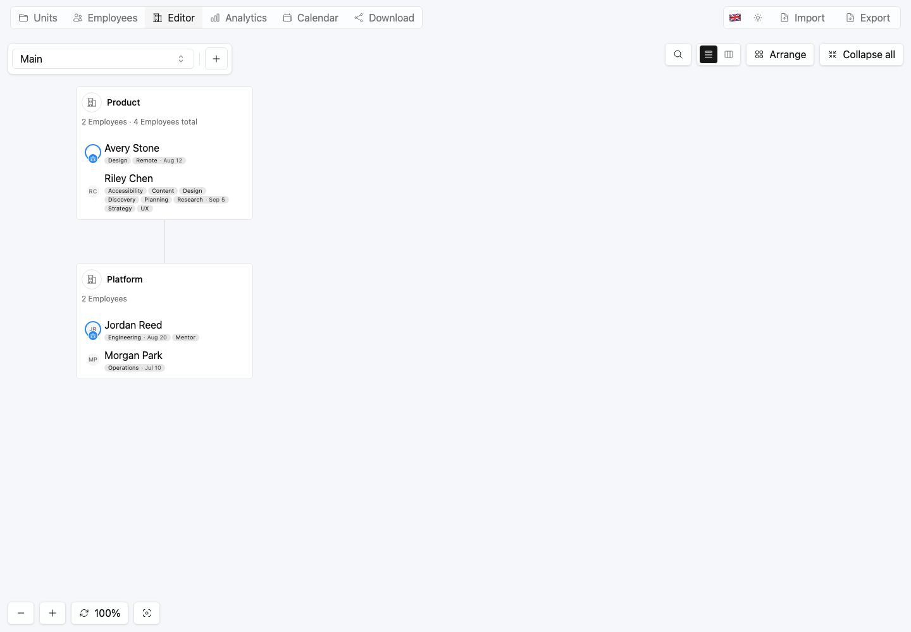
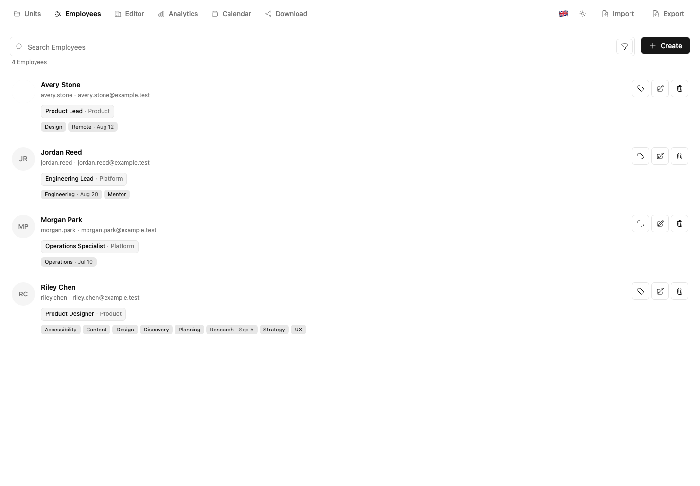
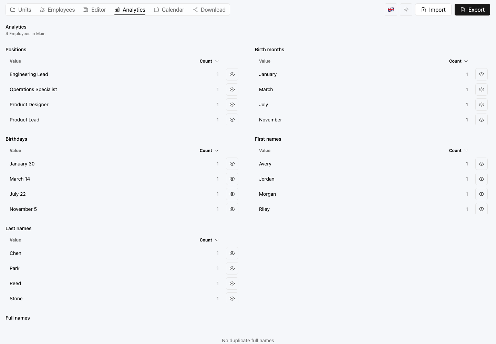
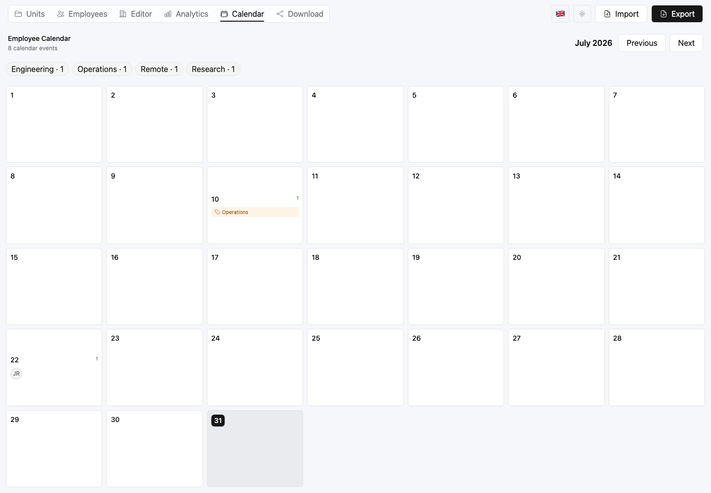
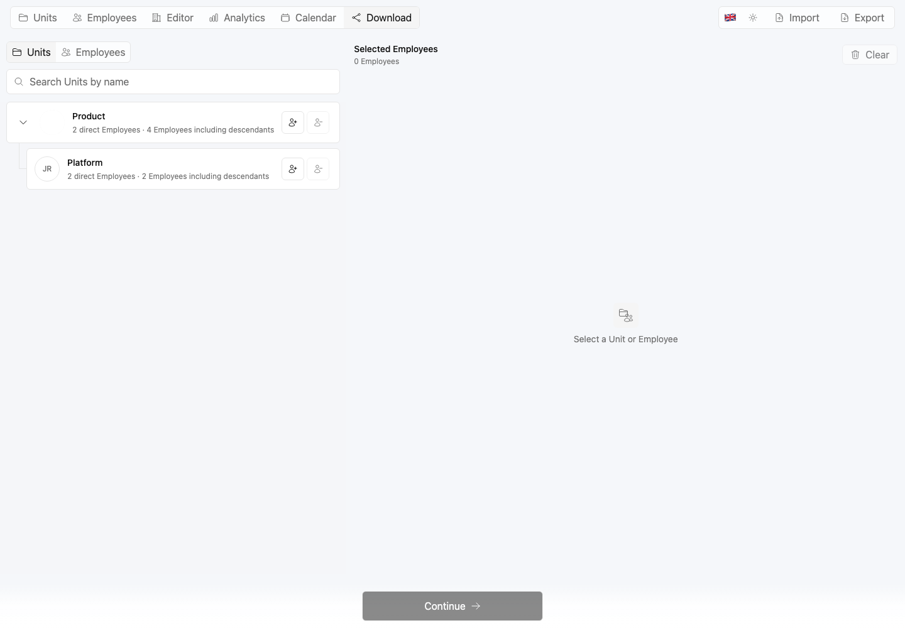
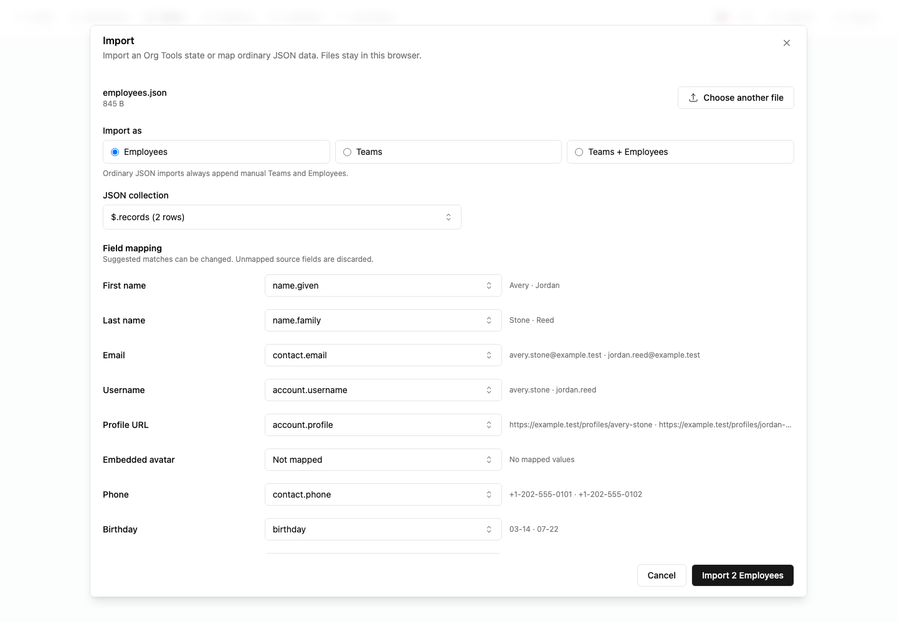

# org-tools

`org-tools` is a private organization editor that runs entirely in the browser.

- Build Units, manage Employees, and arrange them on a visual canvas.
- Search the organization, explore analytics, and track birthdays and dated tags.
- Import JSON and export workspace files, tables, templates, or a canvas PNG.
- Keep organization data in page memory—there is no account, server database, or telemetry.

## Screenshots

Click a preview to open the full-size image.

| Organization Editor | Employees |
| :---: | :---: |
| [](docs/screenshots/synthetic-org-editor.png) | [](docs/screenshots/synthetic-employees.png) |
| Analytics | Calendar |
| [](docs/screenshots/synthetic-analytics.png) | [](docs/screenshots/synthetic-calendar.png) |
| Download | JSON import |
| [](docs/screenshots/synthetic-download.png) | [](docs/screenshots/employee-import-mapping.png) |

See the [complete screenshot gallery](docs/screenshots.md) for every workflow.

## Run locally

Requires Node.js 20 or newer and pnpm 10.33.2.

```sh
pnpm install --frozen-lockfile
pnpm dev
```

Open [http://localhost:3000](http://localhost:3000).

More: [Usage](docs/usage.md) · [Privacy](docs/privacy.md) · [Contributing](CONTRIBUTING.md) ·
[License](LICENSE)
