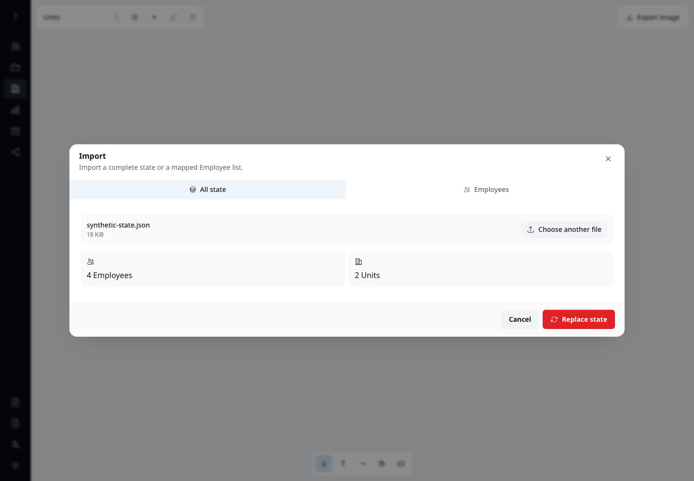
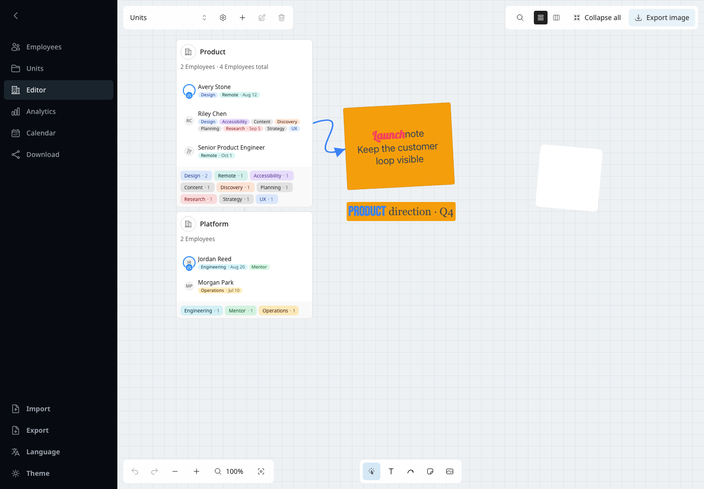
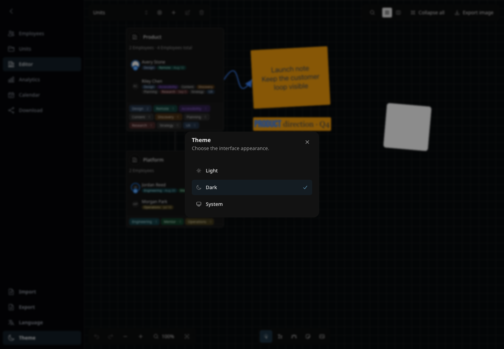
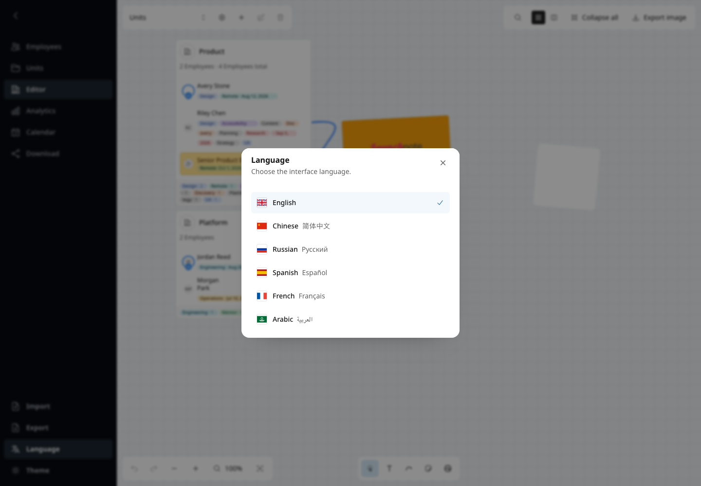
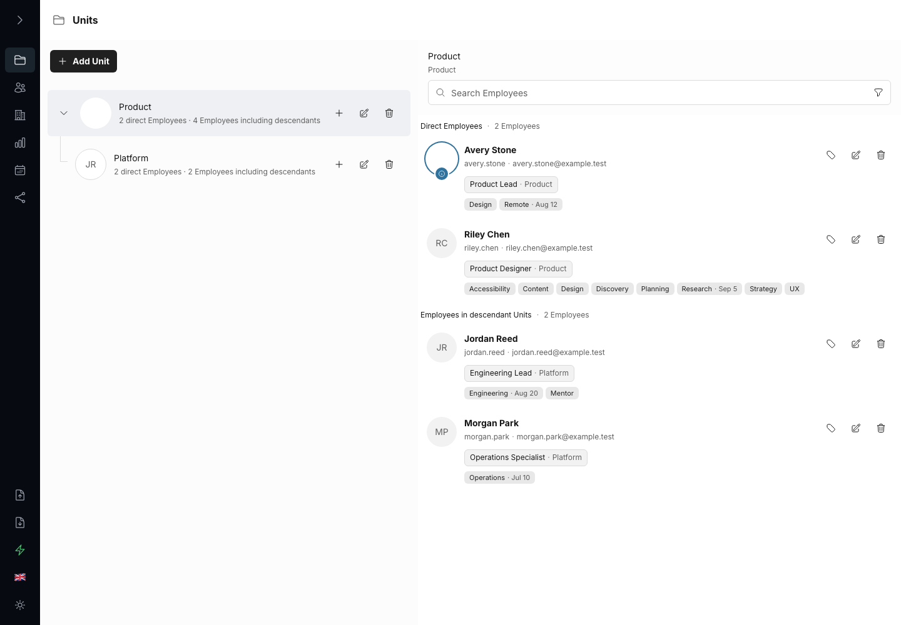
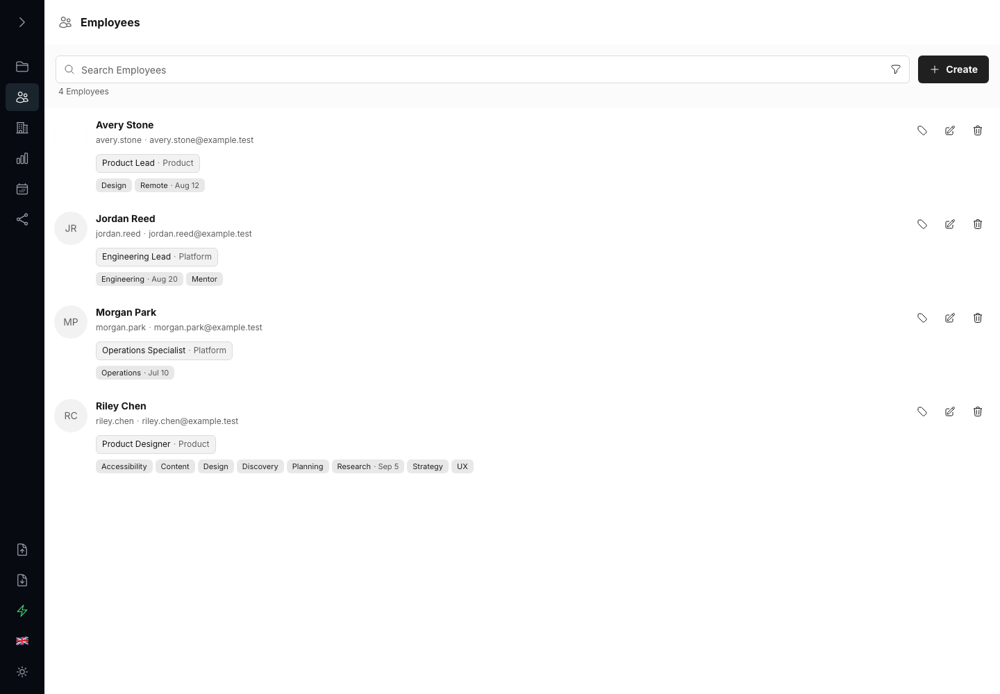
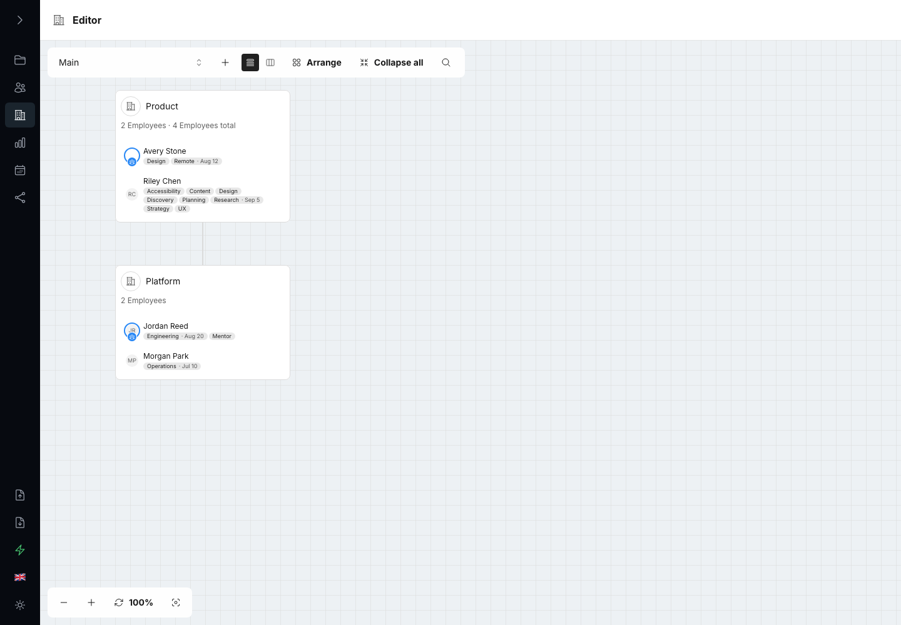
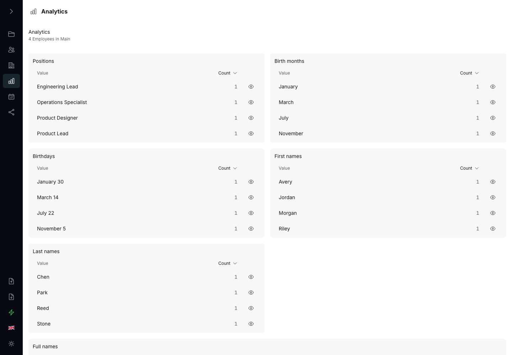
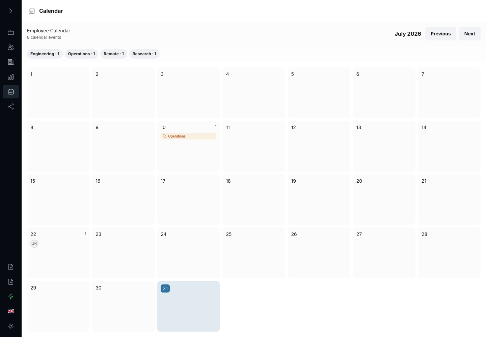
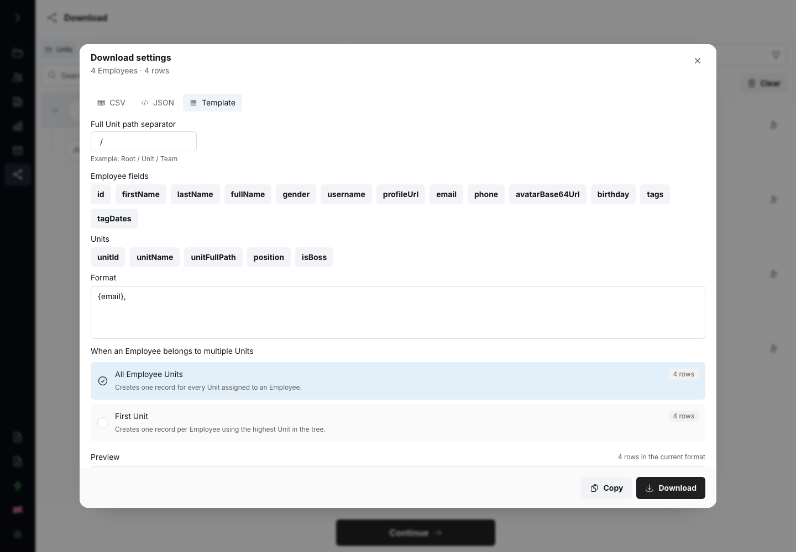

# org-tools

`org-tools` is a private organization editor for Units, Employees, visual structure, Analytics,
Calendar, and local data downloads.

[Open Org Tools on GitHub Pages](https://iwonz.github.io/org-tools/) — the complete browser-only
application. Its organization state exists only in memory, can synchronize between currently open
tabs, and enters or leaves through explicit Import and Export. It has no backend, accounts,
telemetry, remote logging, or background requests.

## Screenshots

| Import | State Export |
| :---: | :---: |
| [](docs/screenshots/demo-import.png) | [](docs/screenshots/demo-export.png) |
| Theme | Language |
| [](docs/screenshots/demo-theme.png) | [](docs/screenshots/demo-language.png) |
| Teams | Employees |
| [](docs/screenshots/demo-teams.png) | [](docs/screenshots/demo-employees.png) |
| Editor | Analytics |
| [](docs/screenshots/demo-editor.png) | [](docs/screenshots/demo-analytics.png) |
| Calendar | Data Download |
| [](docs/screenshots/demo-calendar.png) | [](docs/screenshots/demo-download.png) |

The [complete visual capability catalog](docs/screenshots.md) documents all 43 maintained scenarios.

## Run locally

The durable runtime requires Node.js 22.13 or newer and pnpm 11.24.0.

```sh
pnpm install --frozen-lockfile
pnpm dev
```

Open [http://127.0.0.1:3000](http://127.0.0.1:3000). Every organization or durable interface
change is written automatically to the singleton SQLite state; there is no Save action. The default
database is `.org-tools/org-tools.sqlite3`. Override it with `ORG_TOOLS_DB_PATH`, or copy
`.org-tools/config.example.json` to `.org-tools/config.json` and set `databasePath`. Stop the server
before copying the SQLite file.

The local SQLite runtime also provides disabled-by-default MCP access for local coding agents. Use
**MCP** in the sidebar footer to enable it, copy a selected-client setup prompt that installs the
public [`org-tools` skill](skills/org-tools/SKILL.md) and configures the current token, rotate
credentials, inspect applied activity, and perform selective Undo. MCP is never included in the
GitHub Pages runtime. See [Local MCP](docs/mcp.md) for supported clients and the Preview → explicit
approval → Apply contract.

Use `pnpm pages:dev` for the in-memory static runtime. `pnpm pages:build` exports it to ignored
`pages-out`, and `pnpm pages:check` verifies the `/org-tools` base path and absence of API or SQLite
code. Publishing remains an explicit maintainer action through `pnpm pages:publish`.

More: [Usage](docs/usage.md) · [MCP](docs/mcp.md) · [Architecture](docs/architecture.md) ·
[Privacy](docs/privacy.md) · [Performance](docs/performance.md) ·
[Contributing](CONTRIBUTING.md) · [License](LICENSE)
