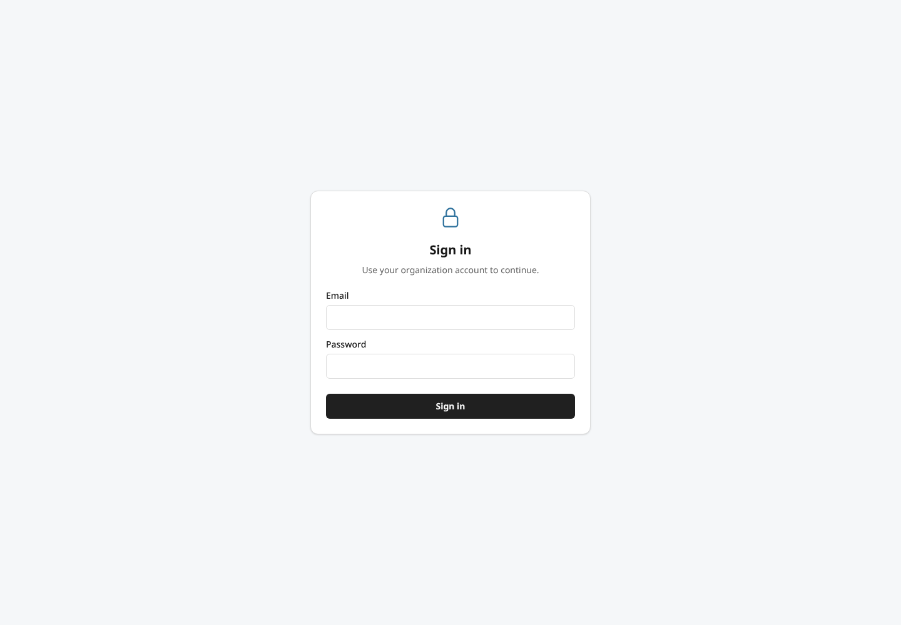
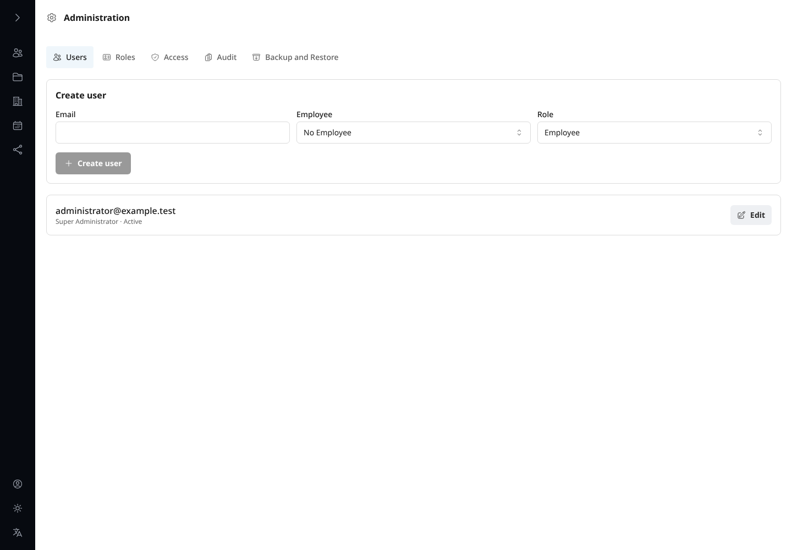
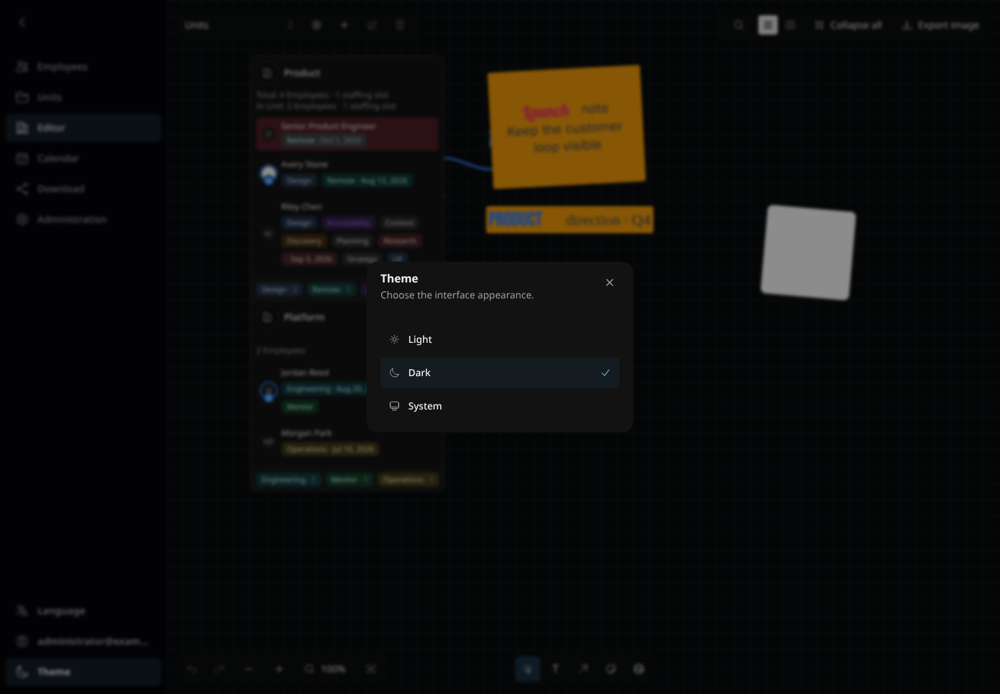
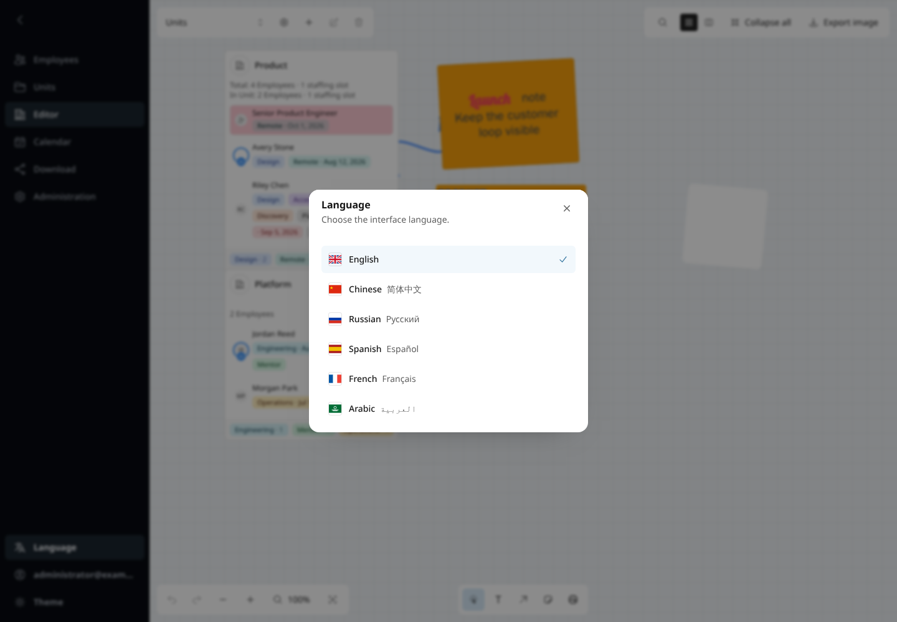
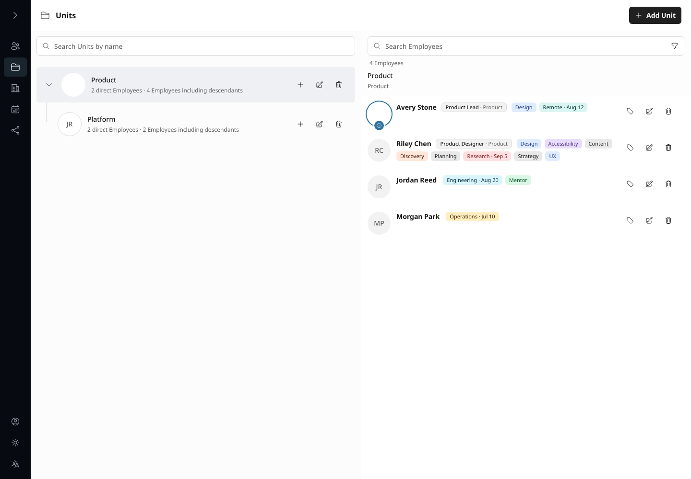
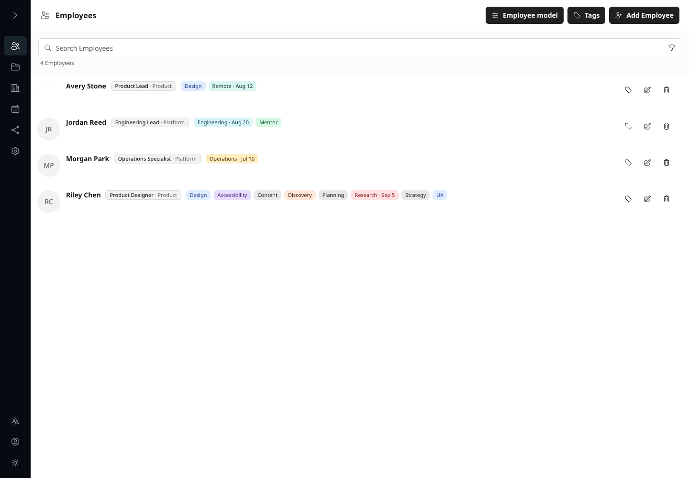
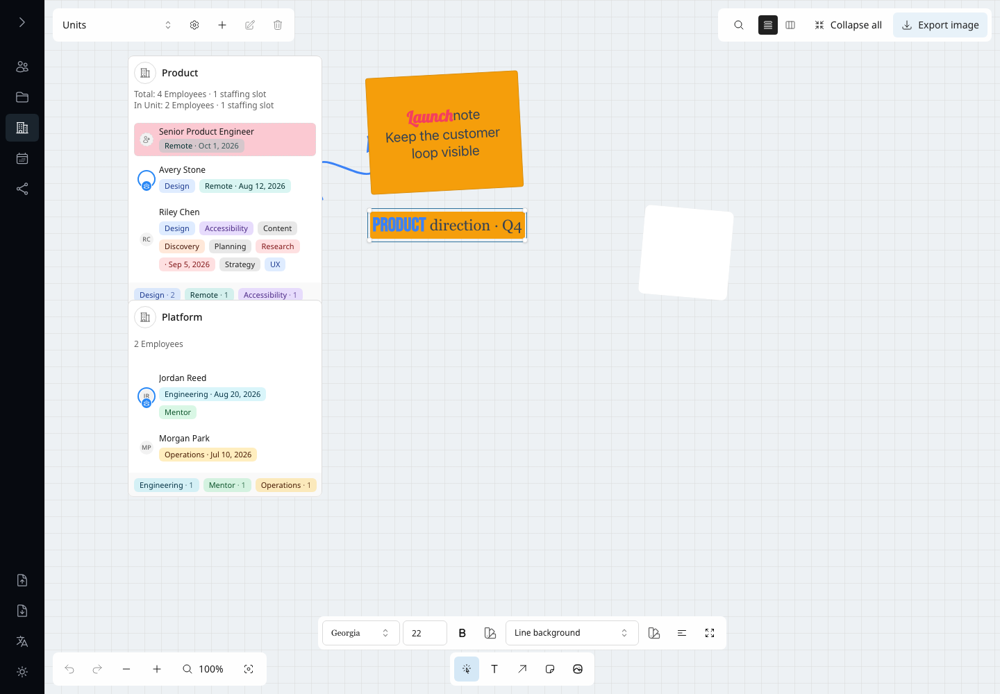
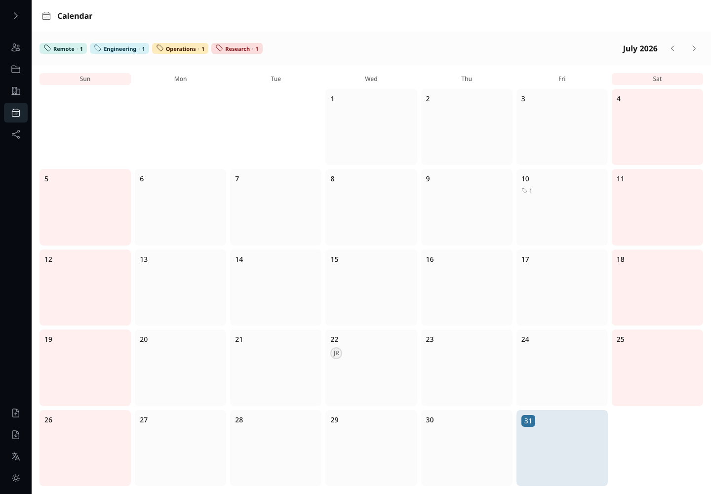
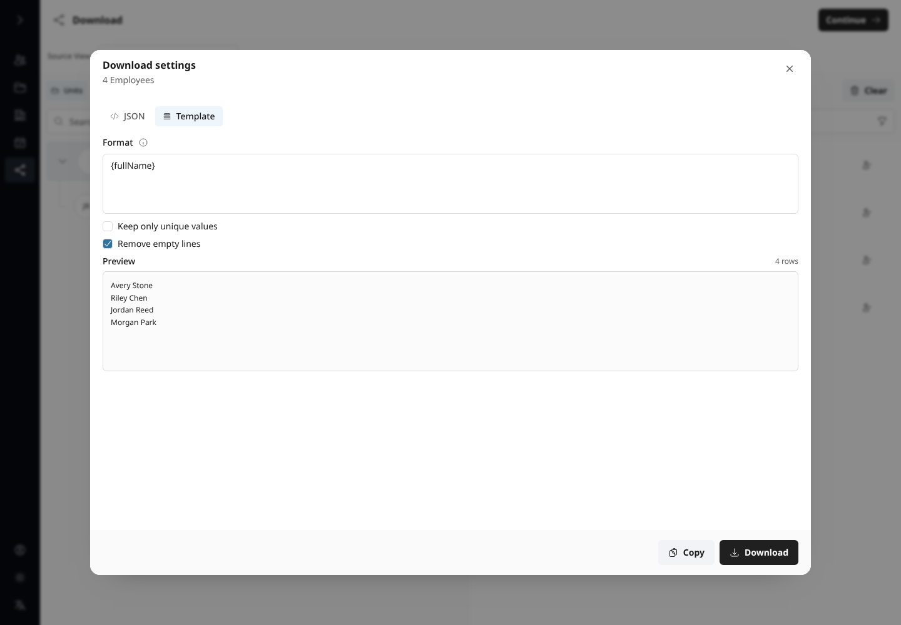

# Org Tools

Org Tools is a self-hosted organization editor for Employees, Units, staffing slots, visual
structure, Calendar, and authorized data/image output. One installation serves one organization.
Accounts use email and password; PostgreSQL stores organization, access, UI, session, and audit
data. The application sends no telemetry and loads no remote runtime assets.

## Run with Docker Compose

Docker and Git are the only host prerequisites.

```sh
git clone https://github.com/iwonz/org-tools.git
cd org-tools
./bin/org-tools env init
./bin/org-tools up
```

Open `http://localhost:3000`, enter the setup token from the generated `.env`, and create the first
Super Administrator. The generated secrets are mode `0600`. PostgreSQL and encrypted recovery
backups use absolute bind paths under `~/.org-tools`; no database volume or data file is created in
the checkout.

For a non-local deployment, set `ORG_TOOLS_PUBLIC_ORIGIN` to the exact HTTPS origin and terminate
TLS at a reverse proxy. The application port remains bound to `127.0.0.1` by default.

Useful operations:

```sh
./bin/org-tools logs
./bin/org-tools down
./bin/org-tools up
./bin/org-tools reset-super-admin-password
```

Run `./bin/org-tools docker-run` for the supported raw Docker equivalent. It reads only the
allowlisted variables in `.env`, creates a private network, runs PostgreSQL and migrations, and
starts the same non-root application image with the same external bind paths.

## Development

```sh
./bin/org-tools env init
./bin/org-tools dev -d
./bin/org-tools run pnpm lint
./bin/org-tools run pnpm typecheck
./bin/org-tools run pnpm test:unit
```

`compose.dev.yaml` supplies hot reload and a toolbox container. Schema migrations run separately
under the database owner; the web process has only the restricted application role and refuses to
start when migrations are pending or unknown.

## Accounts and access

The first account is a Super Administrator. Additional accounts are created in **Administration**
and, except Super Administrators, are linked one-to-one to an Employee with the same email. Roles
are reusable permission sets; direct grants can add permissions to one account. Manager scopes are
derived from boss assignments in the system View and never arise automatically from the Employee
role. Resource policies can restrict fields, Tags, Units, staffing slots, and custom Views. The
server removes inaccessible values before sending a response; Download and PNG export use the same
authorized projection.

## Backup and upgrades

**Administration → Backup and Restore** creates a gzip compressed AES-256-GCM backup protected by
an Argon2id-derived key. Restore validates the complete detached candidate, creates an encrypted
recovery backup in `ORG_TOOLS_BACKUP_PATH`, replaces data atomically, and revokes every session.

Before a PostgreSQL major upgrade, create an encrypted application Backup and a PostgreSQL-native
backup appropriate for the deployment, stop the stack, and follow PostgreSQL's supported major
upgrade procedure. Never copy a live data directory between major versions.

Images are published as `ghcr.io/iwonz/org-tools`: `edge` and `sha-*` track `main`; stable releases
publish `X.Y.Z`, `X.Y`, `X`, and `latest` for `linux/amd64` and `linux/arm64`. Release Please owns
SemVer release PRs, `CHANGELOG.md`, GitHub Releases, and generated release notes.

## Screenshots and documentation

| Sign in | Administration | Theme |
| :---: | :---: | :---: |
| [](docs/screenshots/demo-authentication.png) | [](docs/screenshots/demo-administration.png) | [](docs/screenshots/demo-theme.png) |
| Language | Units | Employees |
| [](docs/screenshots/demo-language.png) | [](docs/screenshots/demo-teams.png) | [](docs/screenshots/demo-employees.png) |
| Editor | Calendar | Data Download |
| [](docs/screenshots/demo-editor.png) | [](docs/screenshots/demo-calendar.png) | [](docs/screenshots/demo-download.png) |

The [56-frame gallery](docs/screenshots.md) documents maintained workflows. More:
[Usage](docs/usage.md) · [Architecture](docs/architecture.md) · [Privacy](docs/privacy.md) ·
[Performance](docs/performance.md) · [Security](SECURITY.md) · [Contributing](CONTRIBUTING.md) ·
[License](LICENSE)
