# Screenshots

The screenshot catalog is generated from the production applications and declared in
`docs/screenshot-demo.json`. The README shows the ten featured module frames; this page covers all 59
current scenarios. Every scenario uses synthetic data, a fixed clock, local fonts, reduced motion,
and no external requests.

The local server suite resets the singleton SQLite state before each workflow. The Pages suite verifies that the same scenarios can be prepared in memory without API or file-persistence controls. Every owned page is monitored for unexpected console warnings and errors, uncaught page errors, failed application requests, and failing same-origin resources. A diagnostic fails with its runtime, scenario, category, source, and bounded message; React, Next.js, MobX, localization, hydration, and application diagnostics are never suppressed. Run `pnpm screenshots:generate`, inspect both themes and all six languages including Arabic RTL, then run it again and compare hashes.

## Import

### State import confirmation

Review the selected filename, size, Employee, and Unit counts before atomically replacing the current state.

Capabilities: Strict state validation, Summary counts, Atomic replacement.

### Invalid state recovery

Reject partial, arbitrary, or malformed JSON without changing data and offer an immediate file re-selection action.

Capabilities: Strict rejection, No mutation, Choose another file.

## Export

### Direct state Export

Download the complete validated application state directly from the sidebar without an intermediate dialog.

Capabilities: Complete state, Direct download, Unsaved live snapshot.

## Recovery

### Database recovery confirmation

Recover from an unavailable or corrupt local database by confirming a timestamped backup and a
clean current-schema replacement.

Capabilities: Explicit recovery, Timestamped backup, Current schema, No silent reset.

## Theme

### Dark theme dialog

Use the expanded sidebar theme dialog to choose Light, Dark, or System appearance.

Capabilities: Dark theme, Light option, System option, Expanded sidebar.

### Light shell and expanded navigation

Inspect the light interface with expanded module labels and locally accessible actions.

Capabilities: Light theme, Expanded sidebar, Module labels, Local actions.

## Language

### Six-language selector

Choose among all six bundled UN-language catalogs with local decorative flags in a compact modal selector.

Capabilities: Six locales, In-place switching, Localized navigation, Persistent locale.

### Arabic RTL interface

Inspect the mirrored Arabic shell and six-language modal while Editor geometry remains
direction-stable.

Capabilities: Arabic locale, RTL shell, Selected indicator, Stable modal geometry.

## Teams

### Team hierarchy and roster

Browse the edge-aligned hierarchy, selected path, searchable roster count, and one contiguous direct
and descendant Employee roster with tags and row actions but no redundant section headings.

Capabilities: Nested Teams, Search and counts, Unified roster, Employee actions.

### Create a manual Team

Create a root Team with manual membership and configure its identity and structure.

Capabilities: Create Team, Manual membership, Root hierarchy.

### Configure a Live Team

Build dynamic membership from Employee birthday, position, tags, and source Team rules.

Capabilities: Live membership, Birthday filters, Position filters, Tag filters, Source Teams.

### Edit Team assignments

Edit a Team, select its boss, and manage Employee positions and membership assignments.

Capabilities: Edit Team, Boss assignment, Membership, Per-Team positions.

## Employees

### Employee catalog

Search the complete Employee catalog and use tag, edit, delete, contact, and Team context actions.

Capabilities: Virtualized catalog, Search and counts, Tags, Contact links, Row actions.

### Compound Employee filters

Compose birthday, gender, position, tag, Team, and text criteria with visible match counts. The Tag
section demonstrates complete-catalog Select all and Deselect all controls beside the independent
Without tags option.

Capabilities: Ordered filters, Complete birthday, Tag bulk selection, Custom values, Not filled,
Compound matching.

### Employee model

Configure the four saved Employee-card formats and inspect their real contextual previews on the
Display tab. The following Value and Template frames retain coverage of the Model tab.

Capabilities: Display formats, Token suggestions, Contextual previews, Atomic draft save.

### Custom Value field

Configure a named typed Employee value, required behavior, and stable options for forms, filters,
imports, and output.

Capabilities: Value field, Data type, Required value, Stable options.

### Custom Template field

Compose a derived Employee value from token suggestions and choose local MD5 or SHA-256 hashing.

Capabilities: Template field, Token composition, Dependency validation, Hashing.

### Custom Employee filter

Filter the Employee catalog by computed or stored custom values, including an explicit Not filled
choice.

Capabilities: Custom fields, Virtualized values, Not filled, Compound filtering.

### Tag catalog

Search centralized Tags in padding-free inert rows and inspect named or arbitrary global filled
colors, Employee usage, positive With date counts, a leading reorder handle, and Eye, Color, Edit,
and Delete actions.

Capabilities: Tag catalog, Search, Global colors, Usage counts.

### Tag catalog editor

Rename a Tag in its dedicated focused modal without mixing identity and color changes.

Capabilities: Dedicated modal, Rename, Validation, Explicit save.

### Quick Tag color

[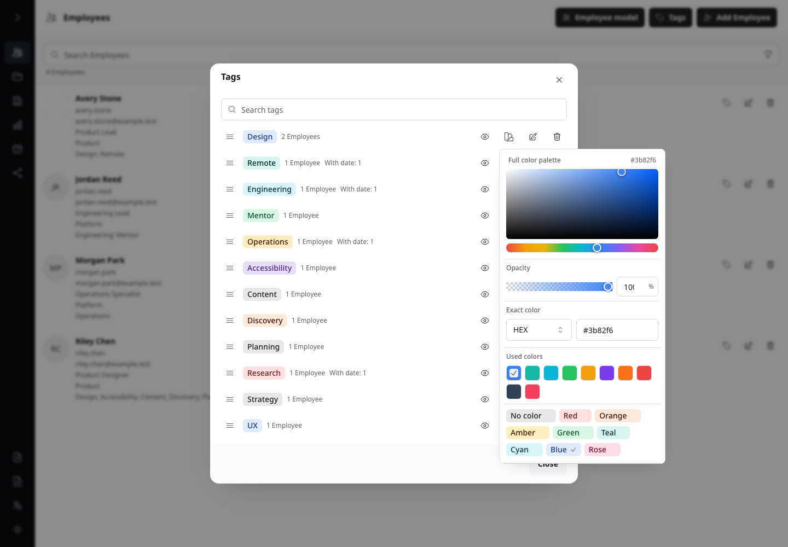](screenshots/feature-employees-tag-color.png)

Open Color directly from a flat catalog row, use the full palette or an exact HTML Keyword, HEX,
RGB, or RGBA value, reuse an alpha-aware color configured in any View, choose opacity independently,
choose a compact named chip, or reset the color. Used colors render as compact checkerboard-backed
swatches. Nested Select content remains above the Popover; Apply commits the complete draft once
while Cancel and dismissal discard it.

Capabilities: Quick color, Used colors, Exact formats, Opacity, Full palette, Compact presets,
Atomic apply.

### Employees with a Tag

[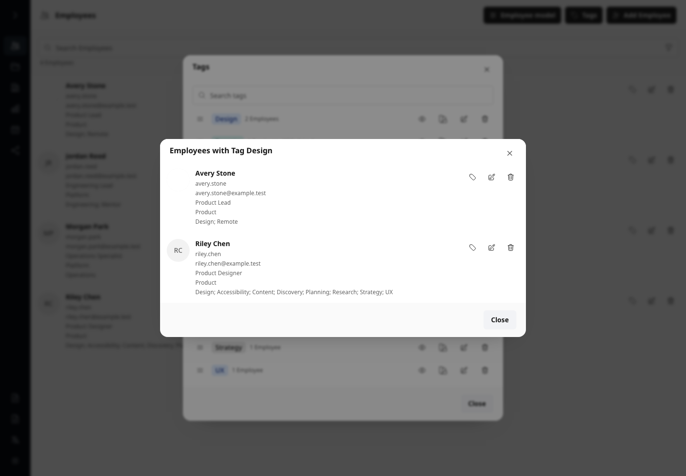](screenshots/feature-employees-tag-members.png)

Open Eye to inspect every current Employee carrying the stable Tag ID in a virtualized full-card
list with the ordinary Tag, Edit, and Delete actions.

Capabilities: Tag membership, Virtualized list, Employee cards, Employee actions.

### Employee profile and assignments

Edit identity, contact, segmented gender, a compound Day/Month/Year birthday with an unknown-year
choice, embedded avatar, draft tags, Team membership, boss state, and positions.

Capabilities: Identity and contact, Complete birthday, Unknown year, Embedded avatar, Tags, Team assignments.

### Tag date calendar

Apply or clear one exact date for an Employee tag through the localized calendar popover.

Capabilities: Quick tags, Dated tags, Calendar picker, Clear date.

### Employee Team assignments

Inspect the lower Employee form with Team membership, boss state, and per-Team positions.

Capabilities: Team membership, Boss state, Per-Team positions, Multiple assignments.

### Local avatar crop

Crop and zoom a local PNG, JPEG, WebP, or pasted image before embedding a 512 by 512 local result.
WebP is preferred and the browser's PNG encoder is the compatibility fallback.

Capabilities: Local file, Clipboard image, Crop and zoom, WebP with PNG fallback.

## Employee transfer

### Employee field mapping

Inspect the first richest bounded JSON record and map every discovered flat or nested source path
left-to-right through a real Org Tools target Select. Occupied targets transfer between rows.

Capabilities: Field mapping, Nested paths, Team assignments, Import preview.

### Employee duplicate resolution

Review UUID-preserving additions, normalized identity duplicates, and skipped Employees with one bulk
policy plus sparse per-Employee overrides before atomic import.

Capabilities: UUID validation, Identity matching, Three review columns, Atomic import.

## Editor

### Visual organization Editor

Arrange opaque Unit cards and representative rich Text, flat bordered Sticker, embedded Image, and curved Arrow tools
on the adaptive snap grid, including bounded edge-pan, hierarchy lines, zoom, history, anchors, and
the bottom-centered canvas toolbar, including a synthetic colored open-position row whose complete
dashed outline distinguishes the vacancy from Employee rows in a manual Unit and Editor PNG. The
mixed roster demonstrates the shared four-pixel interval between adjacent surfaces without an extra
row interval above the first or below the last card.
View management stays top-left, canvas commands and Image export
stay top-right, and history joins zoom at bottom-left. The selected annotation demonstrates the
five local fonts, partial Text/Sticker typography, line fill, bounded two-axis Text auto-fit, the Bold
toggle, and a thin Miro-like frame with four corner markers, two-axis Text resize, outside-corner rotation, and
element-specific context actions without layer-plane commands.

Capabilities: Canvas layout, Text, Sticker, Image, Arrow, Contextual anchors, Adaptive snap grid,
Hierarchy, Zoom-independent transforms and context actions.

### View settings

[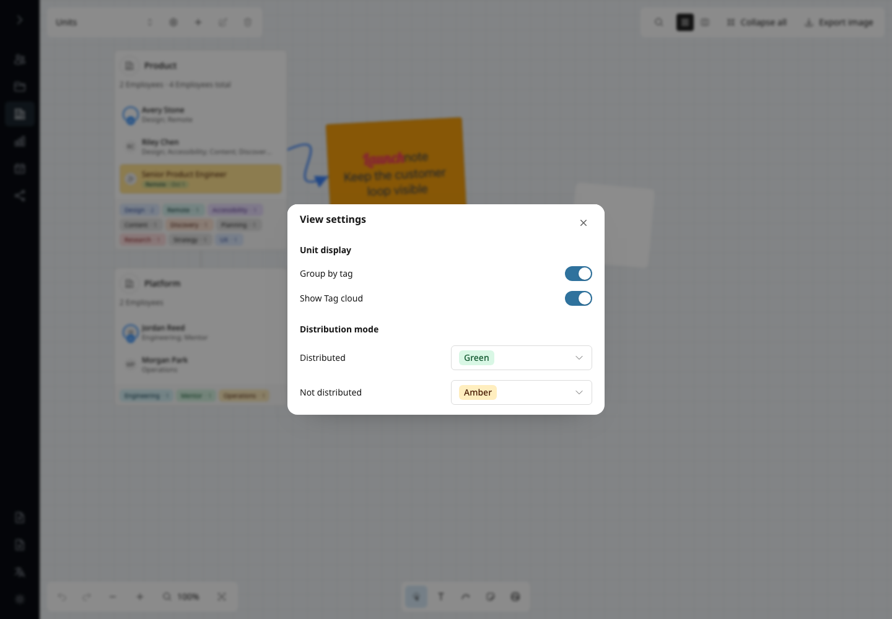](screenshots/feature-editor-view-settings.png)

Use the gear beside the View selector for **Group by tag**, **Show Tag cloud**, and the two
distribution colors. Changes apply immediately to the entire View and support Undo/Redo. PNG follows
the same grouping, footer visibility, and persistent distribution row tones through its light export
palette.

Capabilities: View settings, Grouping, Tag cloud, Distribution colors, Undo and Redo.

### Unit Markdown note preview

[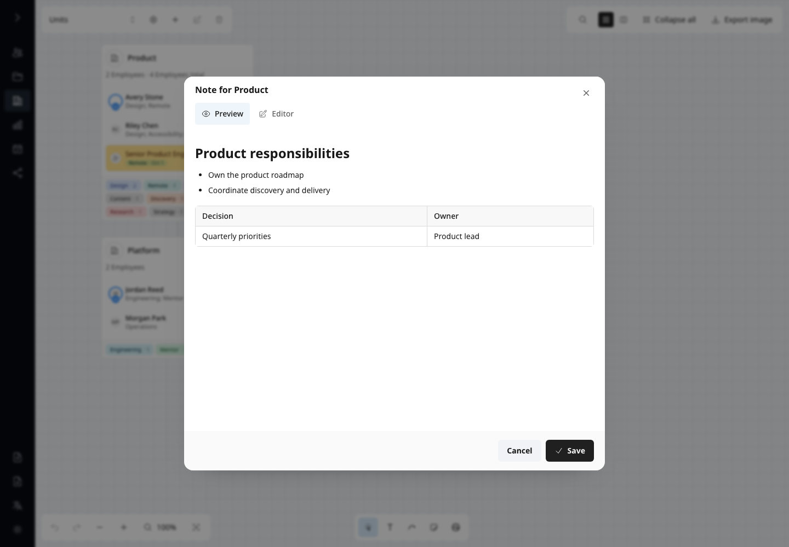](screenshots/feature-editor-unit-note-preview.png)

Review a View-local Unit note rendered from safe bundled GitHub Flavored Markdown. Preview always
opens first and reflects the current draft before it is saved.

Capabilities: Markdown preview, Tables and lists, Draft preview, View-local content.

### Unit Markdown note editor

[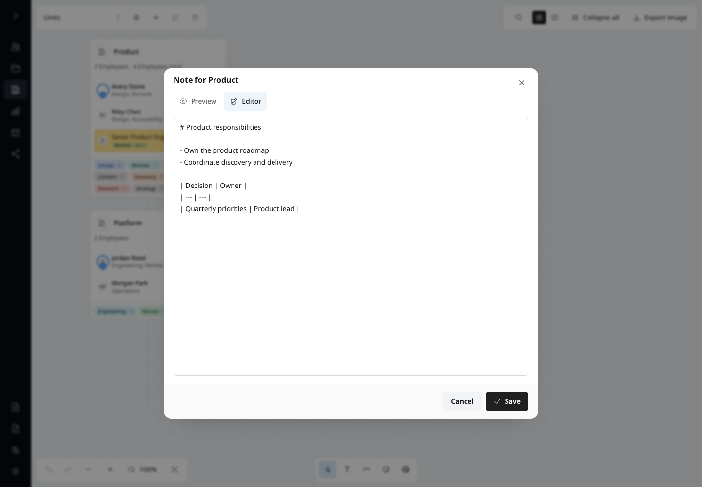](screenshots/feature-editor-unit-note-editor.png)

Write a bounded Unit note in an isolated draft, then commit it as one undoable Editor action.

Capabilities: Markdown draft, 64 KiB limit, Explicit save, Undo and redo.

### Editor View selector

[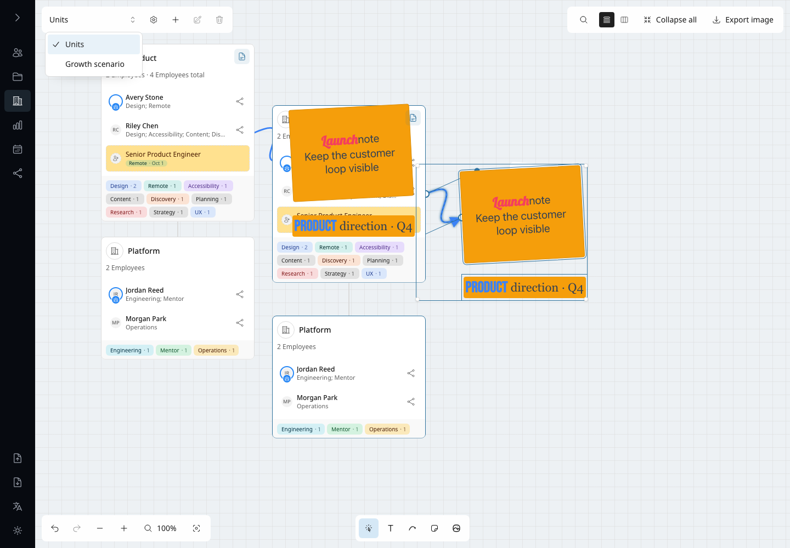](screenshots/feature-editor-view-selector.png)

Switch between the protected system Units structure and independent planning Views after a copied
Unit group has been pasted across View boundaries with regenerated identity.

Capabilities: System View, Custom Views, Cross-View clipboard, Target-only history.

### Create or copy a View

[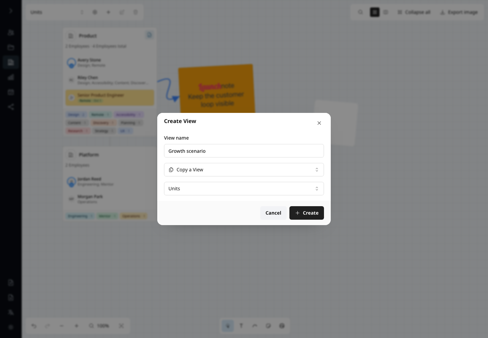](screenshots/feature-editor-view-create-copy.png)

Create a blank planning canvas or copy any existing View with remapped Unit identity and isolated
history.

Capabilities: Blank View, Copy View, Source selection, Unique names.

### Isolated organization scenario

[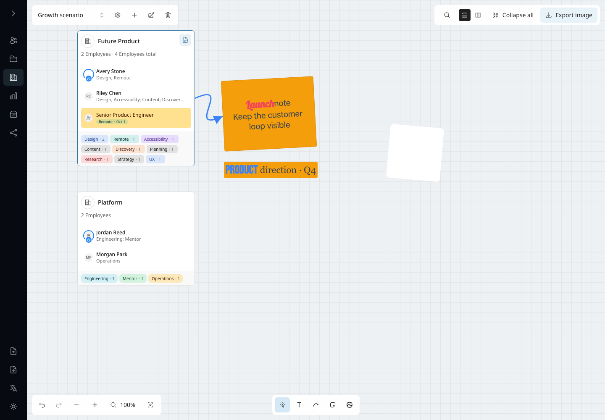](screenshots/feature-editor-view-isolated.png)

Edit the Unit hierarchy, assignments, rules, and geometry inside a custom View without changing the
system Units structure.

Capabilities: Isolated Units, Global Employees, Independent layout, View-local history.

### Rename and delete a View

[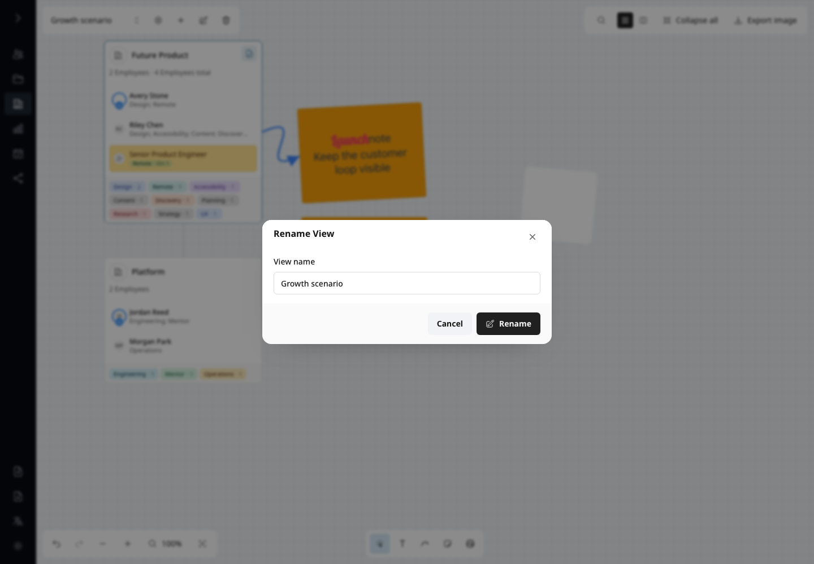](screenshots/feature-editor-view-manage.png)

Rename or deliberately delete a custom View while the protected system Units View remains immutable.

Capabilities: Rename, Delete confirmation, Protected system View, Localized validation.

### Editor search

Reveal the left-expanding search field, locate Units and Employees without leaving the canvas, and
clear the query when Search closes.

Capabilities: Unit search, Employee search, Canvas navigation.

### Unit context commands

Open Unit commands for editing, adding hierarchy, collapse and expand, copy, and local export.

Capabilities: Context menu, Add child Unit, Edit, Collapse and expand, Copy, Export.

### Bulk Employee commands

Select multiple Employee rows and apply shared boss, tag, edit, copy, or delete actions.

Capabilities: Multi-selection, Boss assignment, Bulk tags, Edit, Copy, Delete.

### Employee distribution status

[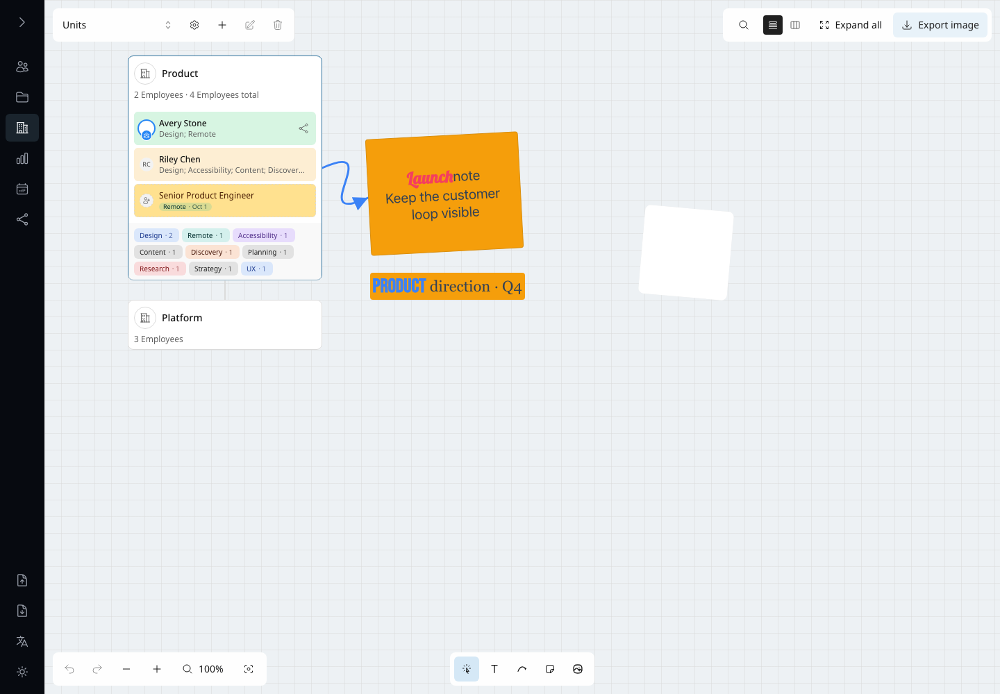](screenshots/feature-editor-distribution-status.png)

Inspect direct members of one Unit with green distributed and amber source-only tonal states.

Capabilities: View-local mode, Direct membership, Manual and Live Units, Accessible status.

### Bulk distribution mode

[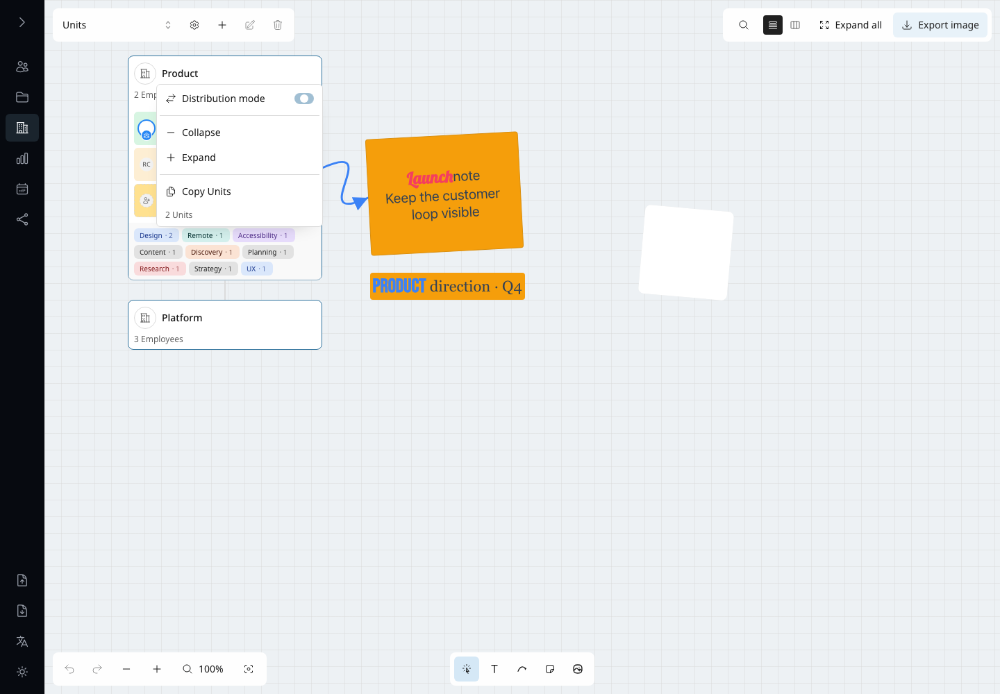](screenshots/feature-editor-distribution-bulk.png)

Apply the View-local distribution mode to a selected Unit set through one accessible mixed-state
switch.

Capabilities: Multi-selection, Mixed state, Single UI update, View-local persistence.

### Employee placement map

[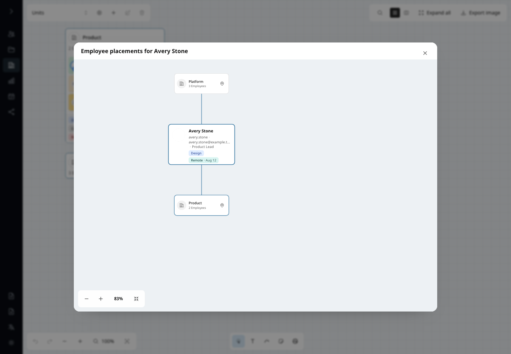](screenshots/feature-editor-placement-map.png)

Inspect one Employee's direct Unit memberships on a read-only relationship canvas and navigate to
an exact occurrence.

Capabilities: Direct memberships, Manual and Live Units, Pan and zoom, Exact navigation.

### Employee placement connections

[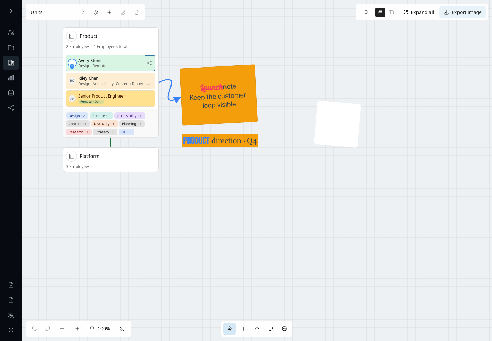](screenshots/feature-editor-distribution-connections.png)

Select one Employee occurrence to trace every other direct placement, including a collapsed-Unit
endpoint.

Capabilities: Single selection, Exact row anchors, Collapsed fallback, Pointer-inert overlay.

### Editor image export

Preview and inspect a full-View local PNG with Fit, zoom, and pan. Unit cards, hierarchy, Text,
Sticker, embedded Image, curved Arrow, Tags, boss marker, and assigned/source-only row tones follow
the durable canvas presentation without printing transient editing chrome. The dialog retains
token-aware Employee format and icon-labelled Copy and Save actions while applying density safety
limits silently.

Capabilities: Full-View PNG, Canvas elements, Distribution tones, Hierarchy, Zoom and pan, Density,
Local Copy and Save.

### Editor text template export

Build a text representation from Employee and Unit tokens, remove whitespace-only lines, and keep
the live preview and every row count aligned with the processed output.

Capabilities: Text template, Field tokens, Empty-line removal, Filtered counts, Scope, Live preview.

### Editor structured JSON export

Export the selected Unit or subtree through the shared sortable JSON field list with scalar, Unit,
and Tag rows in the exact output order.

Capabilities: JSON, Drag-and-drop order, Scoped Employees, Scoped assignments, Units and Tags.

### Editor image detail settings

Configure 1x/2x/3x density, background presets, title, the five local fonts, spacing, localized
boss label, and `@`-assisted conditional Employee card content beside the complete View preview.

Capabilities: Density and silent clamping, Fit/manual preview, Background, Title and font, Spacing
and alignment, Boss label, Employee card content.

## Analytics

### Organization Analytics

Review average age and deterministic age extremes alongside sortable birth-year, position,
birthday, and name distributions.

Capabilities: Age cohorts, Birth years, Counts, Sorting, Virtualized rows.

### Complete Analytics groups

Scroll the unified Analytics surface to inspect birth-year and name distributions in bounded groups.

Capabilities: Birth years, Last names, Full names, Content-sized groups, Internal scrolling.

### Analytics drill-down

Open a distribution value to inspect matching Employee cards and their normal actions.

Capabilities: Value drill-down, Matching Employees, Employee actions.

## Calendar

### Employee Calendar

Navigate locale-correct weeks with soft rose weekend tones, birthdays, compact dated-tag counts,
conditional Today navigation, non-interactive empty dates, and a strong current-day state.

Capabilities: Localized weekdays, Weekends, Birthdays, Tag indicators, Today state.

### Calendar day details

Open a date to inspect Birthdays first and then one interactive heading plus complete Employee-card
list for every dated Tag, all within one virtualized vertical scroll.

Capabilities: Interactive dates, Conditional content, Dated-event cards, Tag history, Employee actions.

### Dated-tag event history

Open a Tag from the horizontal header rail to inspect current and future events without a redundant heading,
plus conditional past events as complete Employee cards with right-aligned actions.

Capabilities: Tag rail, Conditional history, Complete Employee cards, Employee actions, Virtualized dialog.

## Download

### Template Data Download

Configure a separator-based template, row mode, field tokens, whitespace-only line removal, live
preview, copy, and local download.

Capabilities: Template format, Row mode, Field tokens, Empty-line removal, Filtered counts, Preview,
Copy and download.

### Template token suggestions

Use the help affordance and placeholder to discover that typing `@` in the shared Format field
filters localized token suggestions and inserts the stable brace syntax at the caret.

Capabilities: Discoverable shortcut, Caret menu, Localized descriptions, Keyboard selection, Brace syntax.

### Download source selection

Choose a system or custom View, select its assigned Employees from Units or the catalog, inspect the
resulting set, then continue from the shared header.

Capabilities: View source, Team sources, Employee sources, Selected set, Search and filters, Exclusions.

### JSON Unit and Tag exclusions

Enable ordinary Unit and Tag rows in the sortable field list, rename and reorder their nested
fields, and exclude exact Units or normalized Tag labels through searchable virtualized menus.

Capabilities: Inline collections, Nested field order, Field naming, Unit exclusions, Tag exclusions.

### JSON Download settings

Order scalar Employee fields and optional Unit and Tag rows in one list, then configure their JSON
names and nested field order.

Capabilities: JSON, Unified field list, Drag-and-drop order, Nested Unit fields, Nested Tag fields.

### JSON Download preview

Inspect the lower field list and formatted JSON structure before copying or downloading the local file.

Capabilities: Remaining fields, Formatted JSON, Copy, Local download.

## Review checklist

- Confirm Import exposes All state and Employees with mapped fields and normalized identity duplicate
  choices; Export must download only the complete state directly with no dialog.
- Review light and dark themes, all six locale dialogs, Arabic RTL, compact and expanded sidebar
  geometry, and every product module.
- Confirm startup uses one centered icon-only loader with no visible technical status copy.
- Confirm dialogs, popovers, filters, error states, Editor exports, Analytics drill-down, Calendar events, and Download previews are fully visible.
- Confirm Tag rows are padding-free and have no row-level hover effect while exposing Eye, Color,
  Edit, and Delete in order. Rename uses a dedicated modal; quick Color shows its palette, exact
  typed format Select above the Popover, synchronized opacity controls, all organization-wide Used
  colors, wrapping named chips, Apply and Cancel, and no marker dots or clipping. Verify no
  organization write occurs before Apply and that real alpha plus opaque readable foregrounds match
  PNG; Eye uses full live Employee cards.
- Confirm thematic icons precede text in buttons and tabs while disclosure, sorting, removal,
  status, and count affordances retain their semantic trailing positions.
- Confirm Units always exposes hierarchy-name search for a nonempty structure, its path/search aligns to roster avatars, direct and
  descendant Employees form one contiguous list, and its count sits below search without roster-section headings.
- Confirm Calendar day details are one scroll with Birthdays first and each dated Tag as an
  interactive heading followed by complete Employee cards with Tag, Edit, and Delete actions.
- Confirm empty Calendar dates do not expose a pointer, hover treatment, or day-details dialog.
- Confirm Calendar tag history omits the Current and upcoming heading and exposes complete Employee
  cards while retaining the conditional Past section.
- Confirm an unselected Editor Unit keeps its resting background and opacity during passive hover in
  both themes.
- Confirm the Editor system View is the same Unit document used by Units; custom Views isolate Units,
  assignments, rules, geometry, history, selection, and viewport while global Employee and Tag edits
  remain visible everywhere. Copy in one View and Paste in another regenerates Unit IDs and leaves
  Undo isolated to the target; state replacement clears the transient shared clipboard. System View
  lifecycle actions stay disabled, and View controls show no hover or native tooltip.
- Confirm Editor PNG previews preserve the live Unit header rhythm, centered avatars, aligned name
  and tag columns, complete chip-internal tag wrapping without ellipsis, boss marker, variable row
  heights, exactly four logical pixels between adjacent Employee/open-position surfaces with no
  outer row gap, content-sized direct-Employee Tag footer chips with equal insets, persistent distribution
  row tones and optional open-position tonal backgrounds resolved from the complete active View,
  transparent vacancies, and connection endpoints without card overlap, membership-type labels,
  placement overlays, or transient editing chrome.
- Confirm Unit, Employee, connection, and marquee drags keep moving through smooth bounded edge-pan,
  retain document-anchored previews, and commit no more than one viewport and one structural update.
- Confirm deleting nested and overlapping Unit selections produces no diagnostics after reload and
  leaves no stale Editor, Units, filter, expansion, or active Download references.
- Confirm distribution mode can be enabled on a selected Unit set through checked, unchecked, and
  mixed switch states, uses green and amber tonal rows for
  direct manual or resolved Live membership, preserves status fill through selection, keeps Employee
  names in the normal theme text color for both statuses, and draws
  paths only for one selected Employee occurrence. Collapsed targets use an endpoint marker,
  multi-selection hides paths, Editor PNG keeps persistent row tones without the overlay, and JSON,
  Template, and Employee output remains distribution-neutral. Confirm ordinary sources exclude
  distribution-enabled references from their placement actions
  and maps, while reference sources retain every direct placement; open maps react to membership
  and mode changes. Confirm map viewport controls remain transient, and Unit
  actions navigate to an expanded, centered, selected occurrence.
- Confirm every Employee Tag filter preserves catalog order and searches normalized labels. Select all and Deselect
  all affect only visible search results while hidden selections and Without tags remain unchanged.
  Tag catalog counts stay inline immediately after the Tag at desktop and narrow widths; zero With
  date counts are hidden. Check full-row pointer previews, animated insertion, edge scrolling, touch, reduced motion,
  filtered insertion, keyboard moves, and cancellation including peer catalog replacement.
  Preview must write nothing and successful release must commit exactly once.
- Confirm each layout direction button explicitly selects its direction, repeated activation
  arranges the applicable selection or hierarchy again, and Undo/Redo restores both direction and
  geometry. Verify every hierarchy total includes
  unique direct and descendant Employees, including repeated ancestor memberships and bosses.
- Confirm View settings is available beside the selector for system, custom, and empty Views. Its
  Unit display switches control all manual/Live Units and PNG, default on, and support Undo/Redo.
  Distribution colors adapt rows, paths, and endpoint markers in both themes. Every Tag,
  distribution, open-position, Text, Sticker, and Arrow shared picker preserves opacity between
  color choices, exposes every distinct global and inactive-View Used color, stays scrollable,
  restores focus, applies once, and cancels cleanly. The Arrow tool uses one Bezier curve with a
  filled triangular end marker and Image uses the rounded photo glyph. Unit cards retain only the
  note action in their upper corner. Copying a View retains settings; Unit Paste uses target settings.
- Confirm Editor Export exposes Image, JSON, and Template, and that Data Download exposes only JSON
  and Template. Russian uses its localized Template label consistently, JSON groups support naming
  and searchable exclusions, and previews remain bounded. Both Template formats use one Format field
  whose help icon and placeholder disclose the `@` menu that inserts the existing `{token}` syntax;
  help must also explain `?` conditionals. Full-View Image uses the same input and the same
  clipboard/download action icons as scoped Image export.
- Confirm a plain canvas-element click selects only that element, Ctrl/Cmd creates an explicit
  group, choosing a creation tool clears prior selection, and element right-click exposes only
  global Back/Front, Duplicate, and Delete actions. Verify four visible corner markers, transparent
  side resize targets, four outside-corner rotation targets, stable screen sizing across zoom, whole
  Width/Height values, bounded word-aware Text fitting, shared Text/Sticker range formatting, a
  stable live center for free and attached single-element rotation,
  hidden resting connectors, one outlined hovered owner with its complete anchor set during Arrow
  creation or attachment, exact-anchor starts and nearest-target emphasis, Shift-only Image aspect
  resize, flat rich Sticker parity, bundled font application, stable nine-way draft alignment,
  icon-toggle Arrow markers, normalized curve preservation, Image selection without properties, two-step
  text Escape behavior, canvas scroll isolation, resting selection clearing, global Front/Back, and
  one compact non-overlapping property row.
- Confirm one keyboard paste gesture creates one structure when both key and paste events fire,
  the no-event fallback runs once, a late event cannot duplicate that fallback, consecutive
  gestures remain independent, and image paste does not also paste the structural clipboard.
- Confirm Employee model exposes accessible switches for Required, Multiple selection, and custom
  options; Required rows have no field background, border, radius, or padding. Employee editing can
  commit a shared custom option and a dated Composite record. Confirm the Display tab previews and
  saves all four formats together, dismissal discards drafts, fallback cards use Employees, Editor
  and both PNG dialogs use their assigned formats, and image-dialog edits remain local.
- Confirm both Editor PNG previews start at Fit, zoom around the pointer, pan without losing the
  image, expose 100% and Fit, retain a manual focal point after regeneration, and omit dimensions,
  effective density, and clamping copy while Copy/Save remain unchanged.
- Confirm both Template surfaces remove whitespace-only lines only while their transient checkbox is
  enabled, and that bounded preview, Copy/Save or Copy/Download, row-mode counts, and preview totals
  all describe the same processed text while JSON remains unchanged.
- Confirm Employee Import shows a bounded richest-record preview beside virtualized fixed-source →
  target-Select rows, transfers occupied targets, imports Teams only through mapping, and keeps
  duplicate review virtualized.
- Confirm an unavailable or corrupt database offers Retry and confirmed Create new without silently
  replacing the existing database family.
- Confirm avatar crop remains interactive, contains the source, and exposes no encoding error; the
  browser suite separately verifies the visually identical PNG fallback when WebP is unavailable.
- Confirm both runtimes expose the same sidebar actions and compact/expanded geometry.
- Require a clean browser diagnostic report for every server and Pages scenario; investigate new warnings instead of broadening an allowlist.
- Reject real data, local filesystem paths, browser notifications, external images, nondeterministic timestamps, clipping, or unintended overlays.
- Regenerate immediately; all 59 PNGs must retain identical hashes. Material differences require
  review and a deliberate update.
