# Screenshots

The repository screenshot demo has two levels. The README keeps a concise ten-frame module overview; this guide is
the complete visual capability catalog. Its contract lives in `docs/screenshot-demo.json`, including
module ownership, featured status, description, and capability coverage for every frame. Generation
and publication checks fail when the manifest, files, README links, or this guide diverge.

Playwright captures the production Next.js server in Chromium at 1440 by 1000, UTC, with a fixed
clock, reduced motion, disabled animations, loaded local fonts, and an isolated SQLite database in
the system temporary directory. Every workflow creates its own obviously synthetic project. The
default locale and color scheme are English and light; the language and theme frames intentionally
display Russian and dark mode respectively. The complete manifest contains exactly 48 PNGs.

Five supporting frames cover persistence surfaces: SQLite autosave plus the browser file menu,
browser autosave, reconnect recovery, and the unsupported-browser fallback. The latter four are
captured from the static Pages production build; all other frames use the local SQLite production
server. `pnpm screenshots:generate` runs both suites and requires exact manifest/file parity.

## Core workflow gallery

| Import | Workspace Export |
| :---: | :---: |
| [](screenshots/demo-import.png) | [](screenshots/demo-export.png) |
| Theme | Language |
| [](screenshots/demo-theme.png) | [](screenshots/demo-language.png) |
| Teams | Employees |
| [](screenshots/demo-teams.png) | [](screenshots/demo-employees.png) |
| Editor | Analytics |
| [](screenshots/demo-editor.png) | [](screenshots/demo-analytics.png) |
| Calendar | Data Download |
| [](screenshots/demo-calendar.png) | [](screenshots/demo-download.png) |

## Scenario intent

| Scenario | Required visible state |
| --- | --- |
| Import | A strict workspace with filename, size, summary counts, warning, and replacement action. |
| Workspace Export | The expanded-sidebar direct action with no format dialog or success banner. |
| Theme | The populated dark Editor, expanded sidebar, and open theme menu. |
| Language | The populated Russian Editor, expanded sidebar, and open language menu. |
| Teams | A selected Unit in a populated hierarchy with its Employee roster and actions. |
| Employees | The searchable catalog, total count, filters, tags, and Employee actions. |
| Editor | Populated Unit cards on the adaptive snap grid with the canvas tool groups. |
| Analytics | Organization totals and distribution groups from the synthetic workspace. |
| Calendar | The current month, clear today state, birthdays, and dated-tag cloud. |
| Data Download | A non-empty selection followed by format, field, row-mode, and preview settings. |

## Complete capability catalog

The overview frames above establish each primary module. The supporting frames below deliberately
open secondary panels, dialogs, menus, and lower content so the full user-visible feature set can be
understood without running the application.

### Project workspaces

#### Project switcher and stable link

[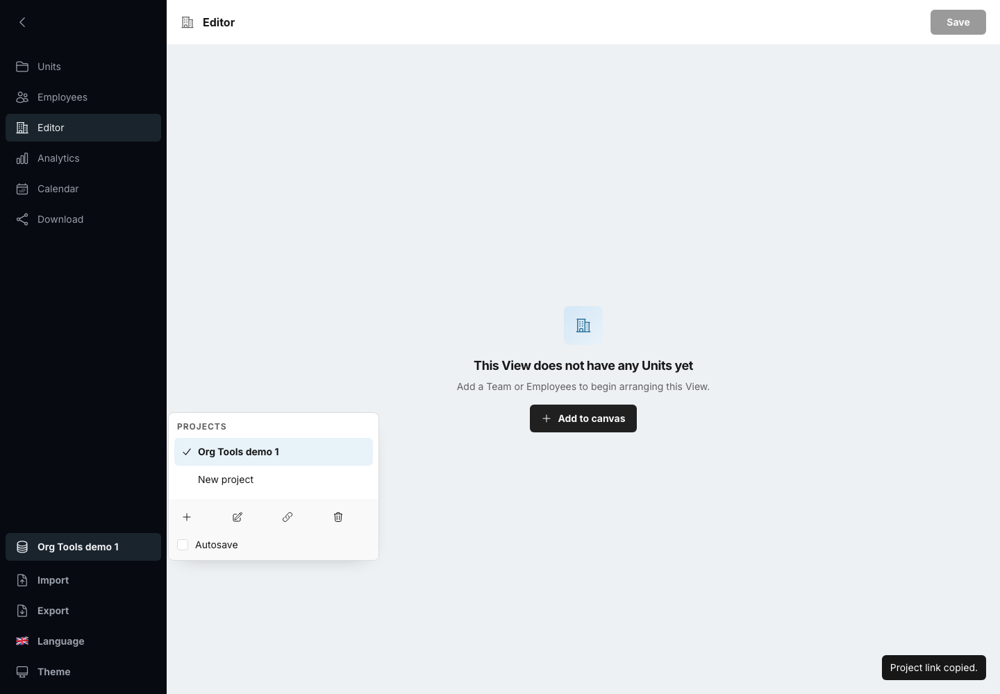](screenshots/feature-project-switcher-link.png)

Shows the sidebar-footer project list, current selection, management actions, and stable-link copy.

#### Create a project

[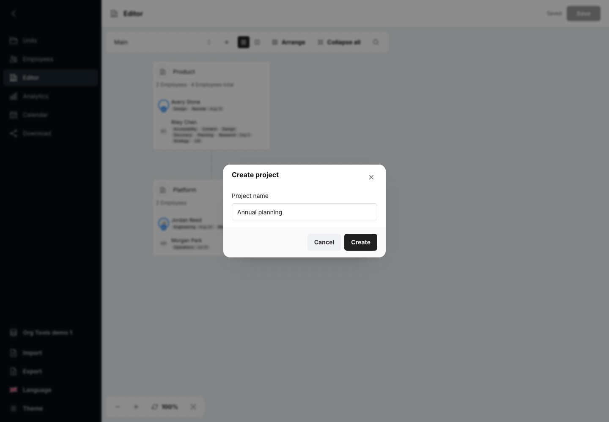](screenshots/feature-project-create.png)

Shows required normalized project naming in the compact creation dialog.

#### Rename a project

[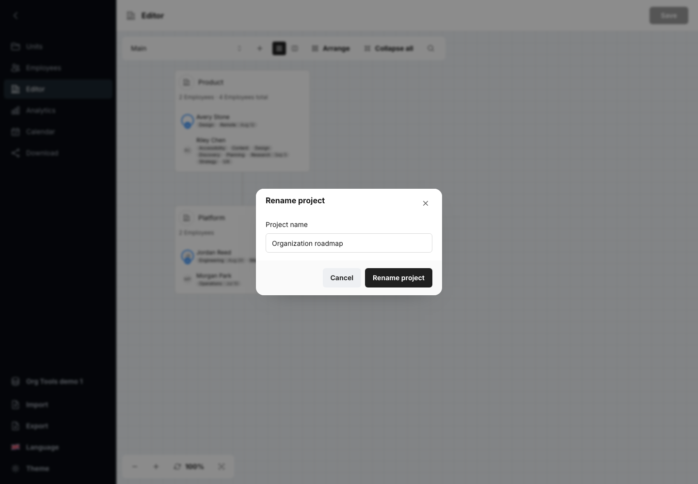](screenshots/feature-project-rename.png)

Shows project rename while the stable project UUID and saved workspace remain unchanged.

#### Delete a project

[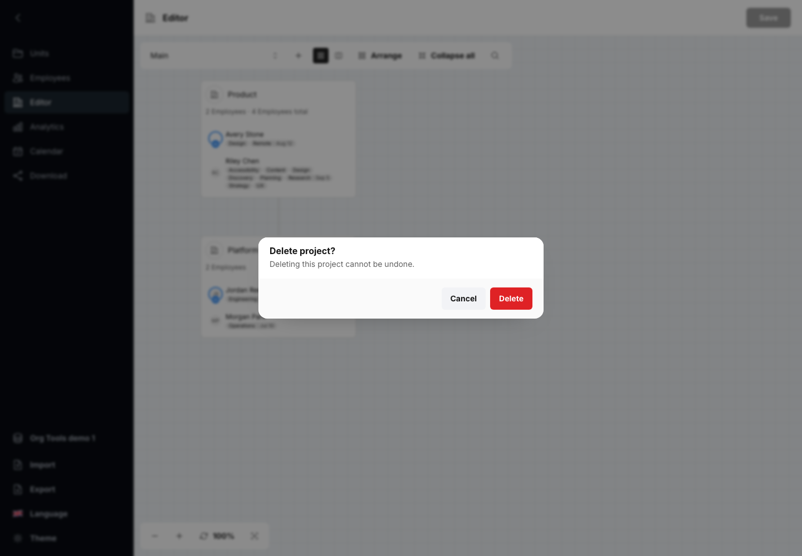](screenshots/feature-project-delete.png)

Shows explicit destructive confirmation and remaining or final-project recovery.

#### Revision conflict

[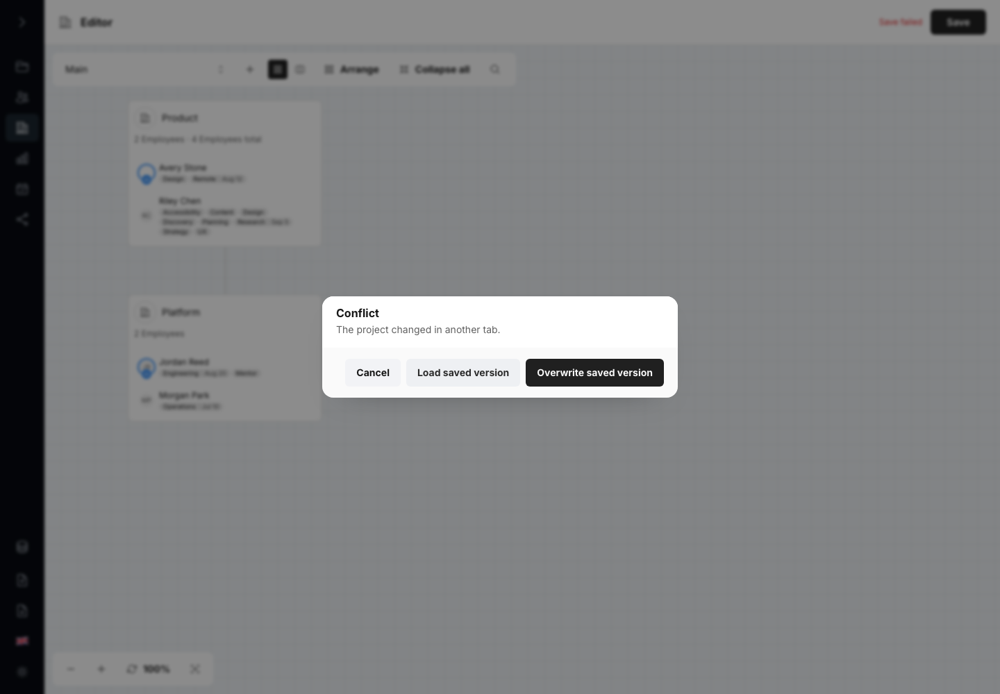](screenshots/feature-project-revision-conflict.png)

Shows Load saved version, explicit overwrite, and Cancel after a stale revision Save.

#### SQLite project autosave

[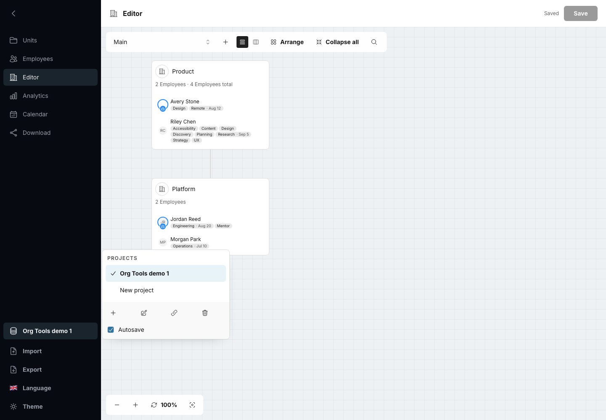](screenshots/feature-project-autosave.png)

Shows the shared default-off autosave option inside the revisioned project switcher.

### Browser file workspace

#### Browser workspace file menu

[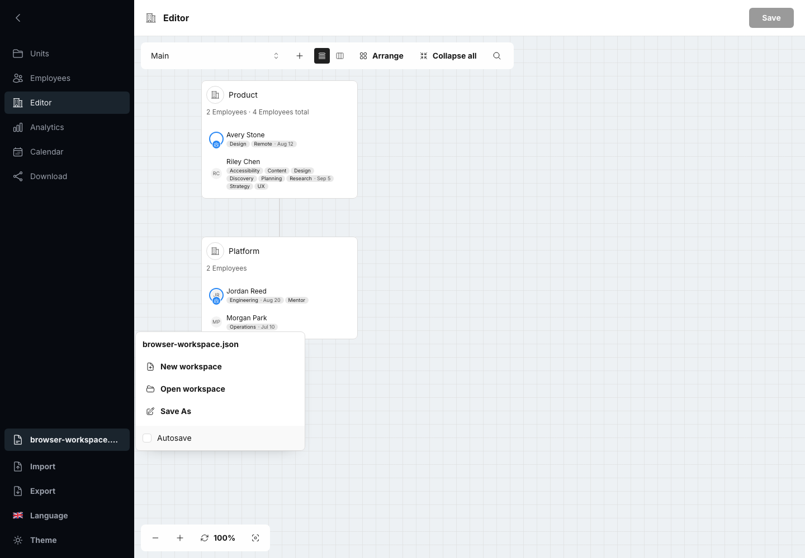](screenshots/feature-browser-file-menu.png)

Shows New, Open workspace, Save As, bound filename, and the shared autosave option.

#### Browser file autosave

[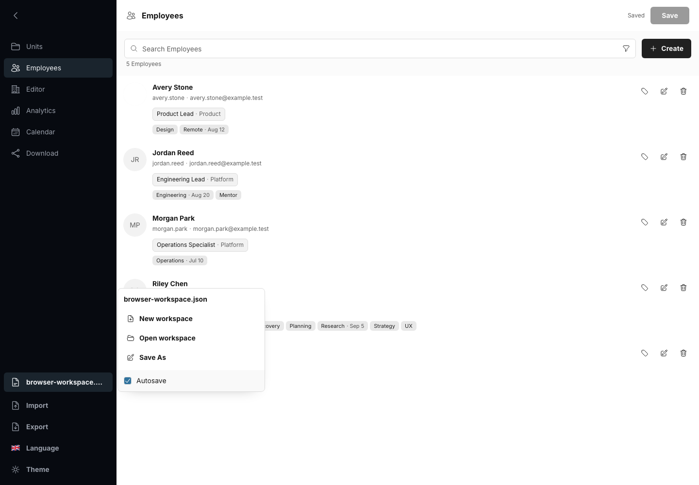](screenshots/feature-browser-autosave.png)

Shows an explicitly bound file, enabled autosave, and stable Saved status after a local write.

#### Reconnect a workspace file

[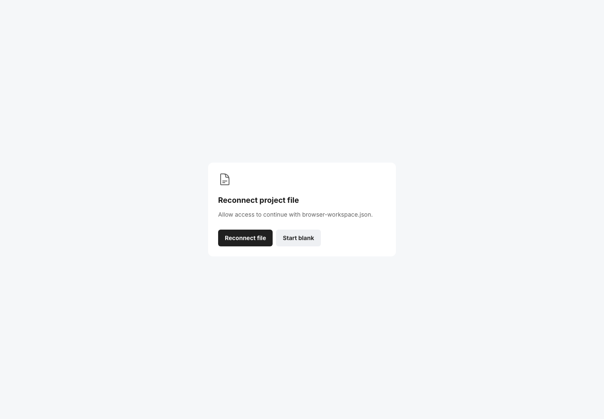](screenshots/feature-browser-reconnect.png)

Shows permission recovery using only the remembered file handle, without loading a snapshot first.

#### Browser download fallback

[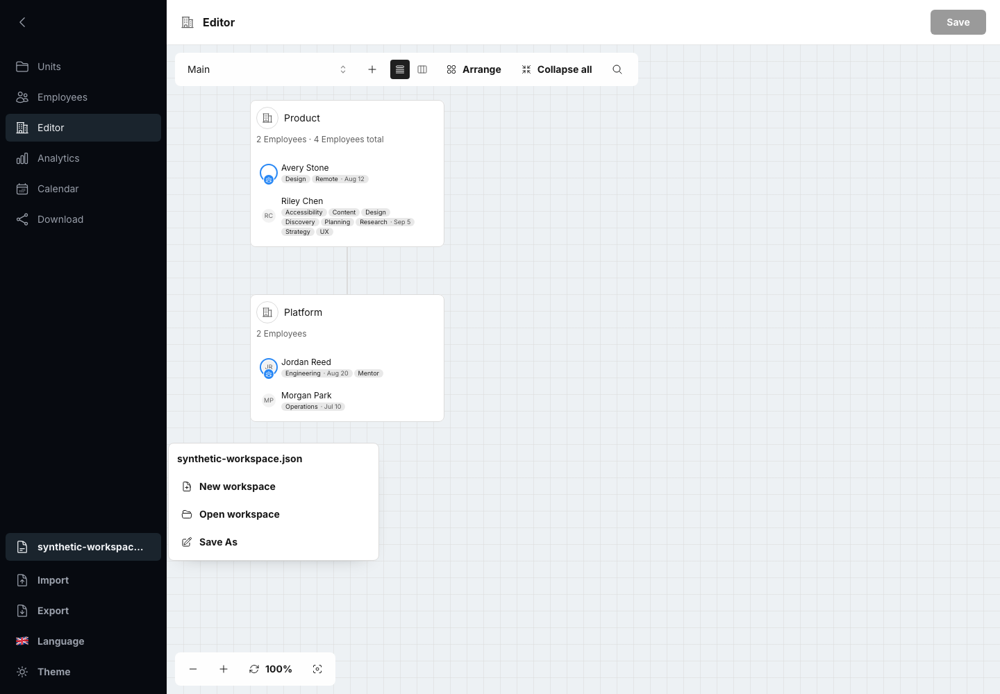](screenshots/feature-browser-fallback.png)

Shows standard workspace-file input/download behavior with unavailable autosave UI omitted.

### Import and workspace Export

#### Invalid workspace recovery

[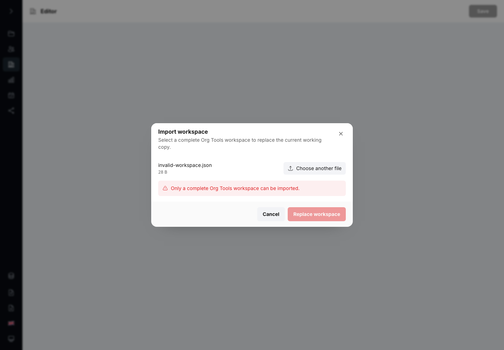](screenshots/feature-import-invalid-workspace.png)

Shows strict rejection without mutation plus the immediate **Choose another file** recovery action.

### Theme and language

#### Light shell and expanded navigation

[](screenshots/feature-theme-light-shell.png)

Shows the light theme, expanded module labels, local file actions, and sidebar collapse control.

#### English language menu

[](screenshots/feature-language-english-menu.png)

Shows the bundled English locale, flag selector, selected indicator, and stable menu geometry.

### Teams

#### Create a manual Team

[](screenshots/feature-teams-create-manual.png)

Shows root-level Team creation, Static membership, Employee search, assignments, and positions.

#### Configure a Live Team

[](screenshots/feature-teams-create-live.png)

Shows dynamic membership with birthday, position, tag, and source-Team rules plus a live preview.

#### Edit Team assignments

[](screenshots/feature-teams-edit.png)

Shows Team editing, boss assignment, membership changes, and per-Team Employee positions.

### Employees

#### Compound Employee filters

[](screenshots/feature-employees-filters.png)

Shows birthday, gender, position, tag, Team, and text criteria with an explicit match count.

#### Employee profile and assignments

[](screenshots/feature-employees-form.png)

Shows identity, contact, gender, birthday, embedded avatar, tags, Teams, boss state, and positions.

#### Employee Team assignments

[](screenshots/feature-employees-form-assignments.png)

Shows the lower form with multiple Team memberships, boss state, and per-Team positions.

#### Tag date calendar

[](screenshots/feature-employees-tag-date.png)

Shows quick tags, exact tag dates, the localized picker, and date clearing.

#### Local avatar crop

[](screenshots/feature-employees-avatar-crop.png)

Shows local PNG, JPEG, WebP, or clipboard input with crop, zoom, and embedded-image output.

### Editor

#### Custom View management

[](screenshots/feature-editor-views.png)

Shows Main and custom Views plus creation from an empty canvas or a copy of Main.

#### Editor search

[](screenshots/feature-editor-search.png)

Shows Unit and Employee search results and direct navigation within the canvas.

#### Custom View selection and actions

[](screenshots/feature-editor-view-management.png)

Shows switching between Main and custom Views plus the contextual rename and delete actions.

#### Unit context commands

[](screenshots/feature-editor-unit-commands.png)

Shows hierarchy creation, editing, collapse and expand, copy, and local export commands.

#### Bulk Employee commands

[](screenshots/feature-editor-bulk-employees.png)

Shows multiple selection and shared boss, tag, edit, copy, and delete actions.

#### Editor image export

[](screenshots/feature-editor-image-export.png)

Shows local PNG preview, scope, and transparent, solid, or gradient background choices.

#### Editor text template export

[](screenshots/feature-editor-template-export.png)

Shows text templates, Unit and Employee field tokens, scope, preview, copy, and local download.

#### Editor image detail settings

[](screenshots/feature-editor-image-settings.png)

Shows title, font, spacing, alignment, boss label, and Employee card-content settings.

### Analytics

#### Complete Analytics groups

[](screenshots/feature-analytics-complete-groups.png)

Shows the lower last-name and full-name distributions with bounded, content-sized groups.

#### Analytics drill-down

[](screenshots/feature-analytics-drilldown.png)

Shows matching Employees for one distribution value with normal Employee context and actions.

### Calendar

#### Calendar day details

[](screenshots/feature-calendar-day-details.png)

Shows one interactive date with birthday and dated-tag rows plus Employee actions.

#### Dated-tag event history

[](screenshots/feature-calendar-tag-events.png)

Shows current, future, and past events opened from the bounded tag cloud.

### Data Download

#### Download source selection

[](screenshots/feature-download-source-selection.png)

Shows Team and Employee sources, the selected set, search, filters, and row exclusions.

#### CSV Download settings

[](screenshots/feature-download-csv-settings.png)

Shows field selection, rename and reorder controls, and row modes for CSV output.

#### JSON Download settings

[](screenshots/feature-download-json-settings.png)

Shows Employee fields, nested Team fields, and output field order for JSON.

#### CSV Download preview

[](screenshots/feature-download-csv-preview.png)

Shows the remaining field list and live CSV rows before copy or local download.

#### JSON Download preview

[](screenshots/feature-download-json-preview.png)

Shows the remaining field list and formatted JSON structure before copy or local download.

## Regenerate and review

Install the matching browser once, then generate the production build and the exact gallery:

```sh
pnpm --filter @org-tools/screenshots exec playwright install chromium
pnpm screenshots:generate
```

Inspect every manifest image at full size. Confirm that dialogs are contained, menus and secondary
panels are open where declared, populated surfaces are legible, previews are non-empty, and neither
light nor dark chrome has clipping or unintended overlays. Reject any image containing real
organization data, a local filesystem path, a browser notification, a nondeterministic timestamp,
or an external image.

Regenerate immediately and compare every image. Dimensions, visible content, and geometry must be
identical. Treat raw PNG hashes as diagnostics rather than the sole pass criterion because the
platform rasterizer can vary a handful of antialiasing pixels even with a pinned browser; any change
beyond that tiny edge-only tolerance requires review. The generator preserves an expected PNG only
when a fresh frame differs by at most two RGB steps across no more than 32 pixels, replaces every
materially changed frame, removes unexpected PNGs directly inside the dedicated screenshot
directory, and fails if any expected file is missing or a stale file remains.

`pnpm test:browser` runs non-visual smoke suites against both production modes. The SQLite suite uses
an isolated temporary database and verifies project redirect, CRUD, compact and expanded
switcher geometry, stable links, explicit Save, UI persistence, dirty navigation, conflicts,
cross-origin rejection, and
blank startup, populated workflows, English and Russian copy, light and dark themes, expanded and
compact responsive sidebar geometry, keyboard and focus behavior, hover and pressed geometry,
adaptive Editor snapping, Analytics and Calendar layout, strict workspace Import, local avatar
handling, direct workspace Export, Download formats, actual browser downloads, and same-origin-only
requests. The Pages suite verifies the `/org-tools/` entry, file and fallback persistence,
autosave/reconnect, all product tabs, JSON download, and the absence of API or external requests.
