# Screenshots

The screenshot catalog is generated from the production applications and declared in
`docs/screenshot-demo.json`. The README shows the ten featured module frames; this page covers all 46
current scenarios. Every scenario uses synthetic data, a fixed clock, local fonts, reduced motion,
and no external requests.

The local server suite resets the singleton SQLite state before each workflow. The Pages suite verifies that the same scenarios can be prepared in memory without API or file-persistence controls. Every owned page is monitored for unexpected console warnings and errors, uncaught page errors, failed application requests, and failing same-origin resources. A diagnostic fails with its runtime, scenario, category, source, and bounded message; React, Next.js, MobX, localization, hydration, and application diagnostics are never suppressed. Run `pnpm screenshots:generate`, inspect both themes and all six languages including Arabic RTL, then run it again and compare hashes.

## Import

### State import confirmation

Review the selected filename, size, Employee, and Unit counts before atomically replacing the current state.

Capabilities: Strict state validation, Summary counts, Atomic replacement.

### Invalid state recovery

Reject partial, arbitrary, or malformed JSON without changing data and offer an immediate file re-selection action.

Capabilities: Strict rejection, No mutation, Choose another file.

## Export

### Direct state Export

Download the complete validated application state directly from the sidebar without an intermediate dialog.

Capabilities: Complete state, Direct download, Unsaved live snapshot.

## Recovery

### Database recovery confirmation

[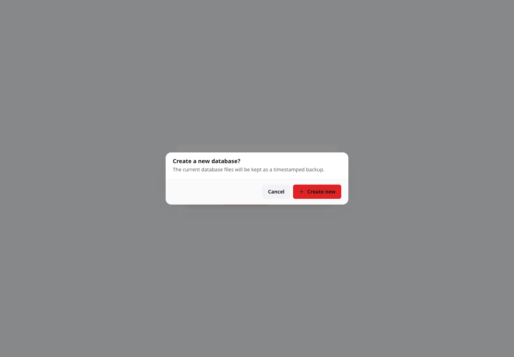](screenshots/feature-database-create-new.png)

Recover from an unavailable or corrupt local database by confirming a timestamped backup and a
clean current-schema replacement.

Capabilities: Explicit recovery, Timestamped backup, Current schema, No silent reset.

## Theme

### Dark theme dialog

Use the expanded sidebar theme dialog to choose Light, Dark, or System appearance.

Capabilities: Dark theme, Light option, System option, Expanded sidebar.

### Light shell and expanded navigation

Inspect the light interface with expanded module labels and locally accessible actions.

Capabilities: Light theme, Expanded sidebar, Module labels, Local actions.

## Language

### Six-language selector

Choose among all six bundled UN-language catalogs in a compact modal selector.

Capabilities: Six locales, In-place switching, Localized navigation, Persistent locale.

### Arabic RTL interface

[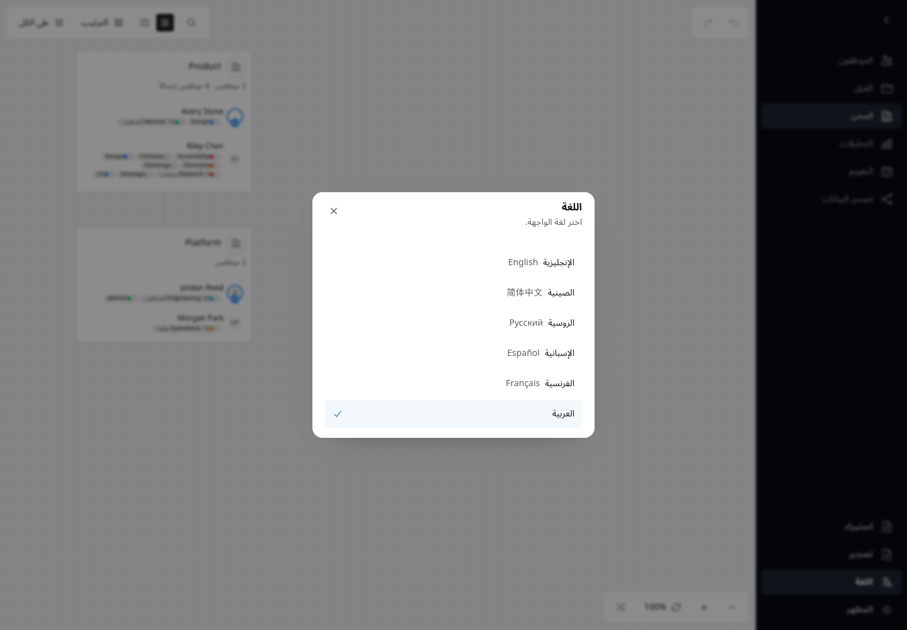](screenshots/feature-language-arabic-rtl.png)

Inspect the mirrored Arabic shell and six-language modal while Editor geometry remains
direction-stable.

Capabilities: Arabic locale, RTL shell, Selected indicator, Stable modal geometry.

## Teams

### Team hierarchy and roster

Browse the edge-aligned hierarchy, selected path, searchable roster count, and one contiguous direct
and descendant Employee roster with tags and row actions but no redundant section headings.

Capabilities: Nested Teams, Search and counts, Unified roster, Employee actions.

### Create a manual Team

Create a root Team with manual membership and configure its identity and structure.

Capabilities: Create Team, Manual membership, Root hierarchy.

### Configure a Live Team

Build dynamic membership from Employee birthday, position, tags, and source Team rules.

Capabilities: Live membership, Birthday filters, Position filters, Tag filters, Source Teams.

### Edit Team assignments

Edit a Team, select its boss, and manage Employee positions and membership assignments.

Capabilities: Edit Team, Boss assignment, Membership, Per-Team positions.

## Employees

### Employee catalog

Search the complete Employee catalog and use tag, edit, delete, contact, and Team context actions.

Capabilities: Virtualized catalog, Search and counts, Tags, Contact links, Row actions.

### Compound Employee filters

Compose birthday, gender, position, tag, Team, and text criteria with visible match counts.

Capabilities: Ordered filters, Complete birthday, Custom values, Not filled, Compound matching.

### Employee model

[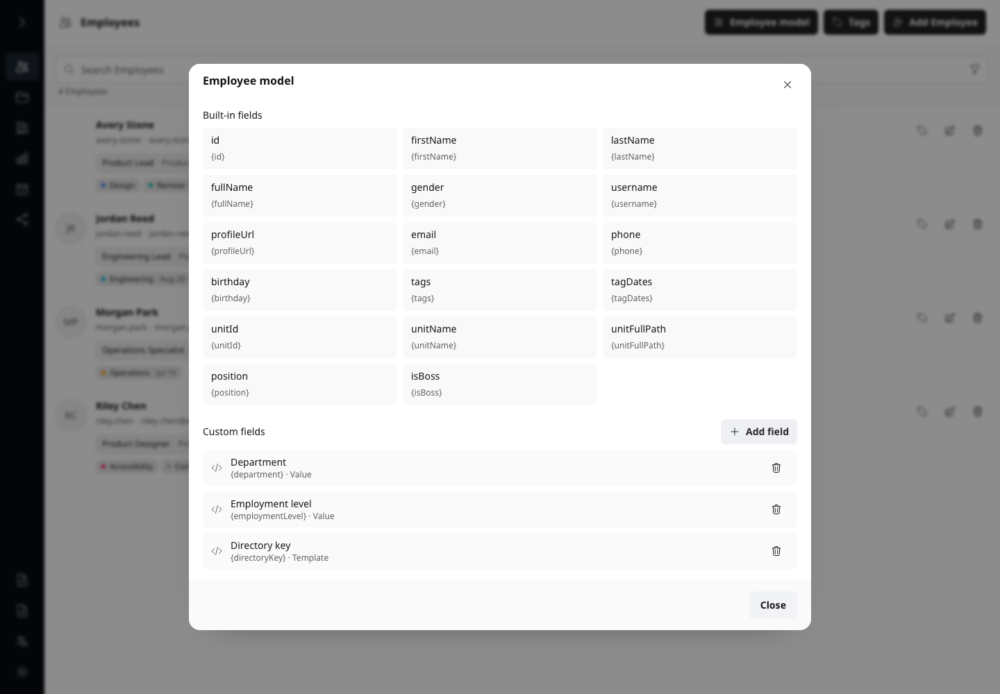](screenshots/feature-employees-model.png)

Inspect the built-in Employee, Unit, and Tag tokens together with configured custom Value and
Template fields.

Capabilities: Built-in fields, Custom fields, Stable token keys, Value and Template kinds.

### Custom Value field

[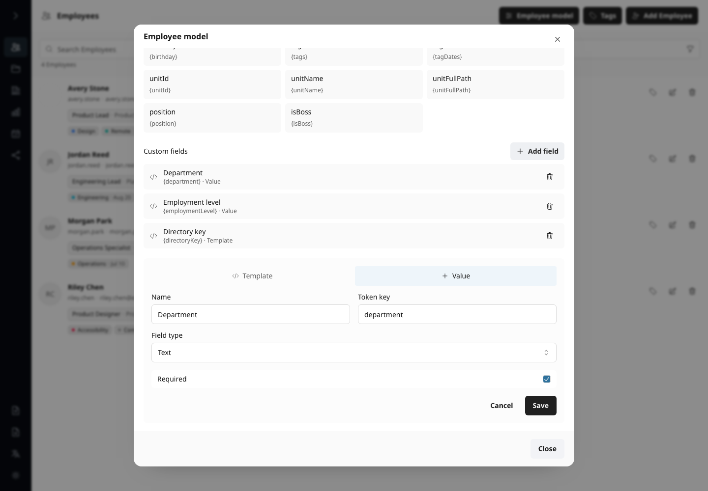](screenshots/feature-employees-model-value.png)

Configure a named typed Employee value, required behavior, and stable options for forms, filters,
imports, and output.

Capabilities: Value field, Data type, Required value, Stable options.

### Custom Template field

[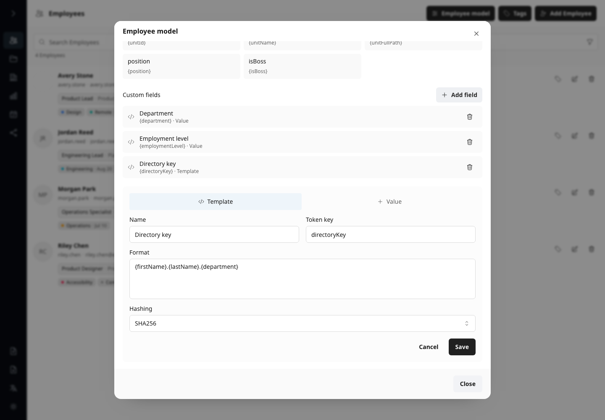](screenshots/feature-employees-model-template.png)

Compose a derived Employee value from token suggestions and choose local MD5 or SHA-256 hashing.

Capabilities: Template field, Token composition, Dependency validation, Hashing.

### Custom Employee filter

[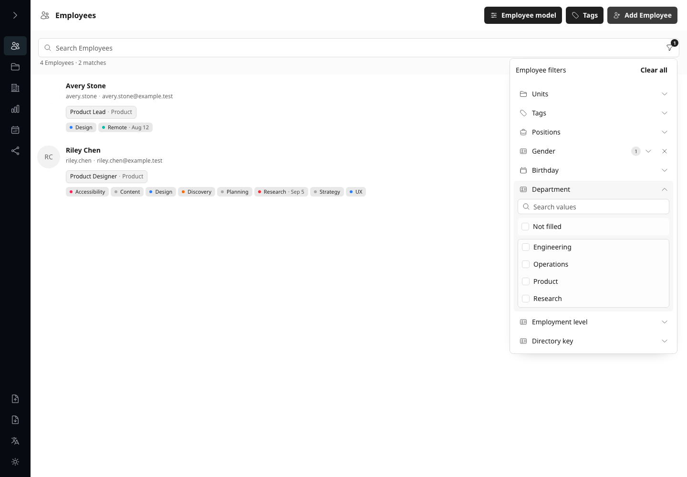](screenshots/feature-employees-custom-filter.png)

Filter the Employee catalog by computed or stored custom values, including an explicit Not filled
choice.

Capabilities: Custom fields, Virtualized values, Not filled, Compound filtering.

### Tag catalog

[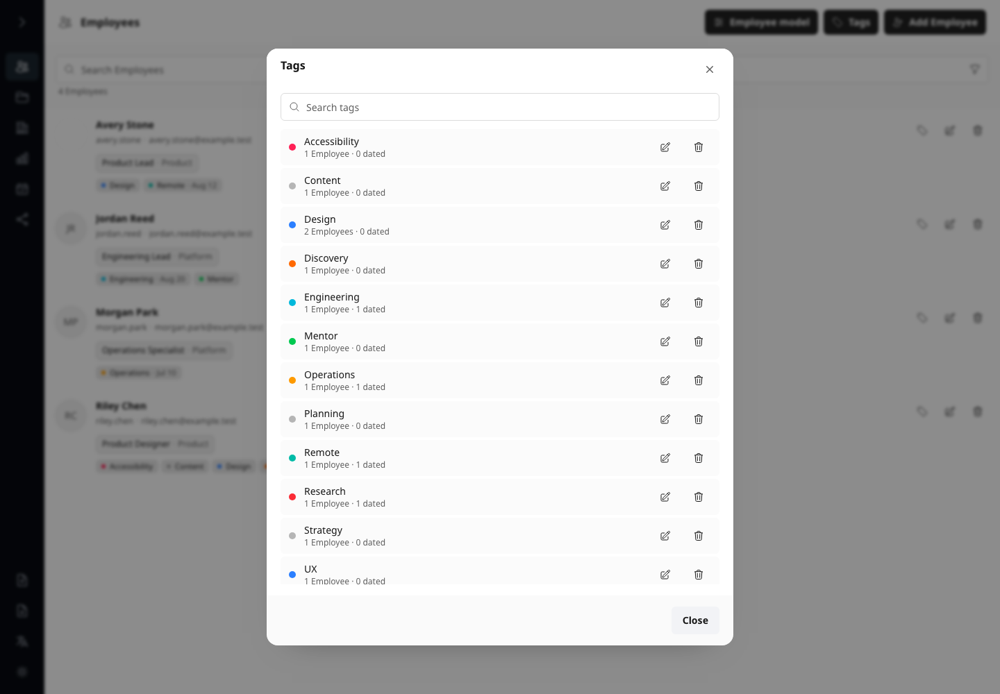](screenshots/feature-employees-tag-catalog.png)

Search centralized Tags and inspect their global color, Employee usage, and dated-assignment counts.

Capabilities: Tag catalog, Search, Global colors, Usage counts.

### Tag catalog editor

[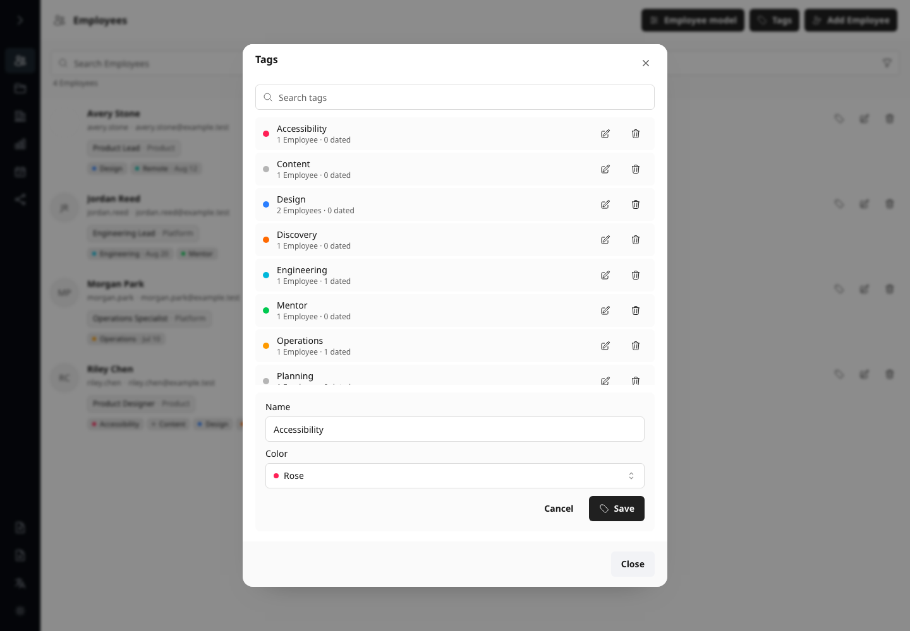](screenshots/feature-employees-tag-editor.png)

Rename a Tag or choose and reset its global semantic color from one controlled catalog.

Capabilities: Rename, Color palette, Reset color, Cascading delete.

### Employee profile and assignments

Edit identity, contact, segmented gender, a compound Day/Month/Year birthday with an unknown-year
choice, embedded avatar, draft tags, Team membership, boss state, and positions.

Capabilities: Identity and contact, Complete birthday, Unknown year, Embedded avatar, Tags, Team assignments.

### Tag date calendar

Apply or clear one exact date for an Employee tag through the localized calendar popover.

Capabilities: Quick tags, Dated tags, Calendar picker, Clear date.

### Employee Team assignments

Inspect the lower Employee form with Team membership, boss state, and per-Team positions.

Capabilities: Team membership, Boss state, Per-Team positions, Multiple assignments.

### Local avatar crop

Crop and zoom a local PNG, JPEG, WebP, or pasted image before embedding a 512 by 512 local result.
WebP is preferred and the browser's PNG encoder is the compatibility fallback.

Capabilities: Local file, Clipboard image, Crop and zoom, WebP with PNG fallback.

## Employee transfer

### Employee field mapping

[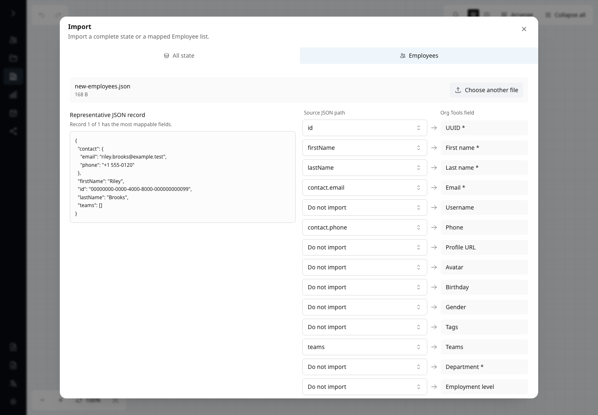](screenshots/feature-employee-import-mapping.png)

Inspect the first richest bounded JSON record and map arbitrary flat or nested source paths
left-to-right into current Employee fields, Tags, and optional Team assignments.

Capabilities: Field mapping, Nested paths, Team assignments, Import preview.

### Employee duplicate resolution

[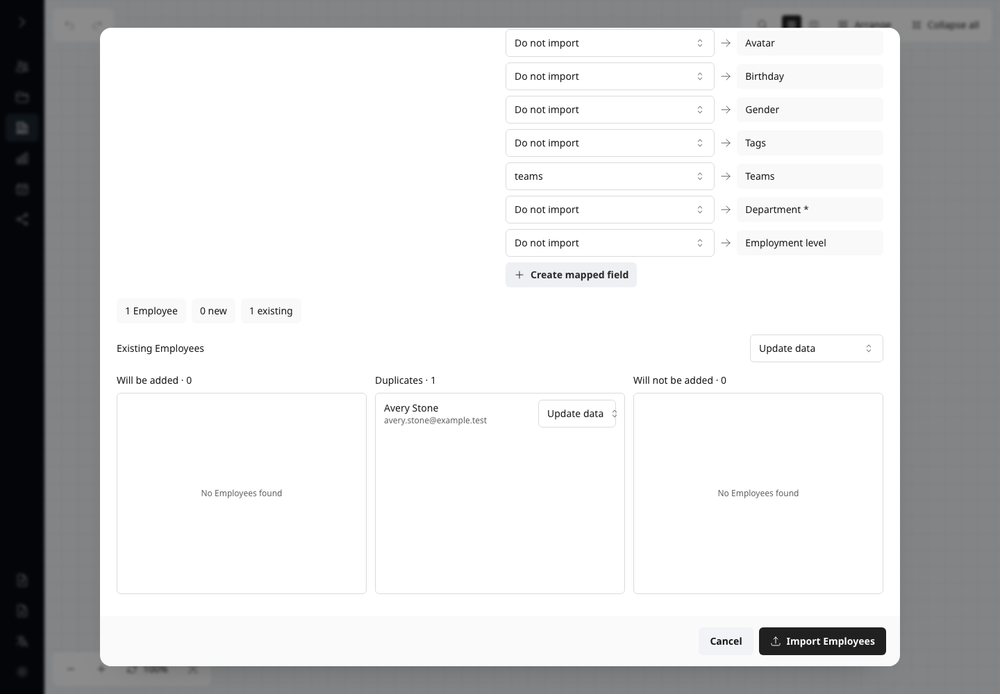](screenshots/feature-employee-import-duplicates.png)

Review UUID-preserving additions, normalized identity duplicates, and skipped Employees with one bulk
policy plus sparse per-Employee overrides before atomic import.

Capabilities: UUID validation, Identity matching, Three review columns, Atomic import.

## Editor

### Visual organization Editor

Arrange opaque Unit cards on the adaptive snap grid with frame-bounded gestures, hierarchy lines, zoom, history, and normal-weight layout controls.

Capabilities: Canvas layout, Adaptive snap grid, Hierarchy, Zoom, Arrange and collapse.

### Editor search

Reveal the left-expanding search field, locate Units and Employees without leaving the canvas, and
clear the query when Search closes.

Capabilities: Unit search, Employee search, Canvas navigation.

### Unit context commands

Open Unit commands for editing, adding hierarchy, collapse and expand, copy, and local export.

Capabilities: Context menu, Add child Unit, Edit, Collapse and expand, Copy, Export.

### Bulk Employee commands

Select multiple Employee rows and apply shared boss, tag, edit, copy, or delete actions.

Capabilities: Multi-selection, Boss assignment, Bulk tags, Edit, Copy, Delete.

### Editor image export

Prepare a local hierarchy PNG whose Unit cards, centered Employee rows, complete wrapping tags,
localized boss marker, and connections follow the live canvas without printing Static/Live
membership type, then choose transparent, solid, or gradient backgrounds in the same dialog.

Capabilities: Inline PNG preview, Complete tags, Membership-neutral cards, Hierarchy, Localized boss
marker, Iconic scope, Background presets.

### Editor text template export

Build a text representation from Employee and Unit tokens with a live preview.

Capabilities: Text template, Field tokens, Scope, Live preview.

### Editor structured JSON export

[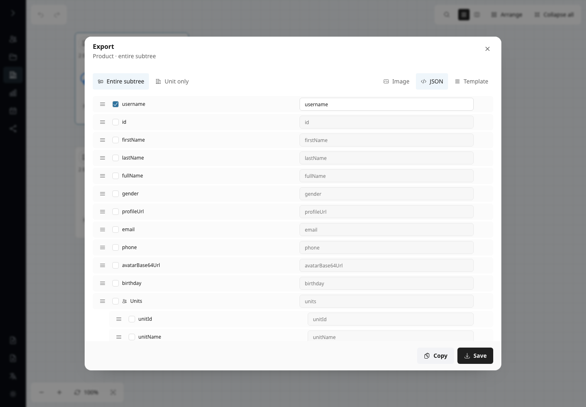](screenshots/feature-editor-json-export.png)

Export the selected Unit or subtree through the shared sortable JSON field list with scalar, Unit,
and Tag rows in the exact output order.

Capabilities: JSON, Drag-and-drop order, Scoped Employees, Scoped assignments, Units and Tags.

### Editor image detail settings

Configure PNG title, font, spacing, icon-only alignment, localized boss label, and Employee card
content below the aligned hierarchy preview without avatar-data template tokens.

Capabilities: Title and font, Spacing and alignment, Boss label, Employee card content.

## Analytics

### Organization Analytics

Review average age and deterministic age extremes alongside sortable birth-year, position,
birthday, and name distributions.

Capabilities: Age cohorts, Birth years, Counts, Sorting, Virtualized rows.

### Complete Analytics groups

Scroll the unified Analytics surface to inspect birth-year and name distributions in bounded groups.

Capabilities: Birth years, Last names, Full names, Content-sized groups, Internal scrolling.

### Analytics drill-down

Open a distribution value to inspect matching Employee cards and their normal actions.

Capabilities: Value drill-down, Matching Employees, Employee actions.

## Calendar

### Employee Calendar

Navigate locale-correct weeks with weekend tones, birthdays, compact dated-tag counts, conditional
Today navigation, and a strong current-day state.

Capabilities: Localized weekdays, Weekends, Birthdays, Tag indicators, Today state.

### Calendar day details

Open a date to inspect Birthdays first and then one interactive heading plus complete Employee-card
list for every dated Tag, all within one virtualized vertical scroll.

Capabilities: Interactive dates, Conditional content, Dated-event cards, Tag history, Employee actions.

### Dated-tag event history

Open a Tag from the horizontal header rail to inspect current and future events without a redundant heading,
plus conditional past events as complete Employee cards with right-aligned actions.

Capabilities: Tag rail, Conditional history, Complete Employee cards, Employee actions, Virtualized dialog.

## Download

### Template Data Download

Configure a separator-based template, row mode, field tokens, live preview, copy, and local download.

Capabilities: Template format, Row mode, Field tokens, Preview, Copy and download.

### Template token suggestions

[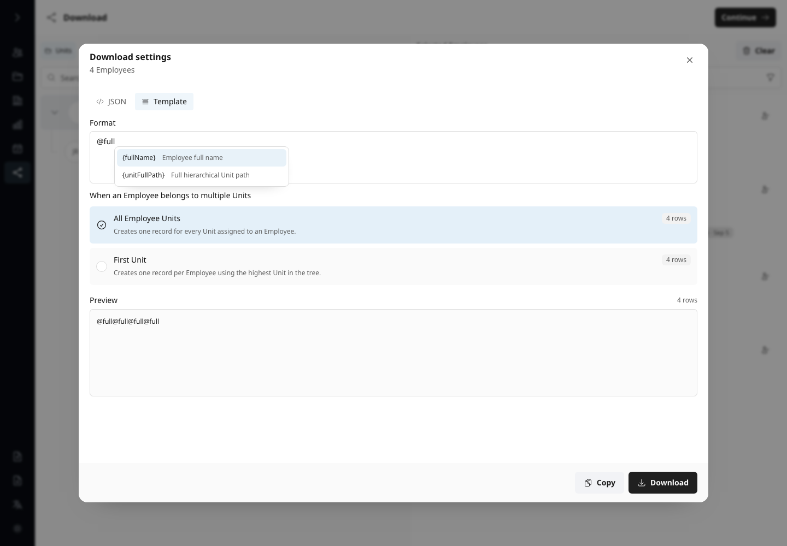](screenshots/feature-download-template-tokens.png)

Type `@` in the shared Format field to filter localized token suggestions and insert the stable
brace syntax at the caret.

Capabilities: Caret menu, Localized descriptions, Keyboard selection, Brace syntax.

### Download source selection

Select Employees from Teams or the catalog, inspect and filter the resulting set, then continue from the shared header.

Capabilities: Team sources, Employee sources, Selected set, Search and filters, Exclusions.

### JSON Unit and Tag exclusions

[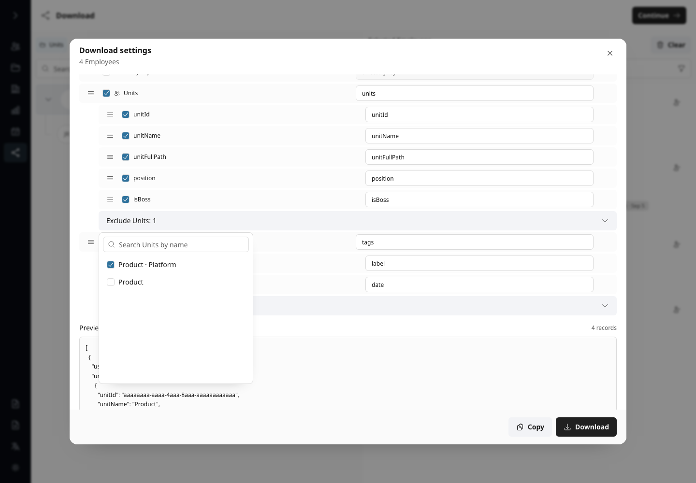](screenshots/feature-download-json-exclusions.png)

Enable ordinary Unit and Tag rows in the sortable field list, rename and reorder their nested
fields, and exclude exact Units or normalized Tag labels through searchable virtualized menus.

Capabilities: Inline collections, Nested field order, Field naming, Unit exclusions, Tag exclusions.

### JSON Download settings

Order scalar Employee fields and optional Unit and Tag rows in one list, then configure their JSON
names and nested field order.

Capabilities: JSON, Unified field list, Drag-and-drop order, Nested Unit fields, Nested Tag fields.

### JSON Download preview

Inspect the lower field list and formatted JSON structure before copying or downloading the local file.

Capabilities: Remaining fields, Formatted JSON, Copy, Local download.

## Review checklist

- Confirm Import exposes All state and Employees with mapped fields and normalized identity duplicate
  choices; Export must download only the complete state directly with no dialog.
- Review light and dark themes, all six locale dialogs, Arabic RTL, compact and expanded sidebar
  geometry, and every product module.
- Confirm startup uses one centered icon-only loader with no visible technical status copy.
- Confirm dialogs, popovers, filters, error states, Editor exports, Analytics drill-down, Calendar events, and Download previews are fully visible.
- Confirm thematic icons precede text in buttons and tabs while disclosure, sorting, removal,
  status, and count affordances retain their semantic trailing positions.
- Confirm Units always exposes hierarchy-name search for a nonempty structure, its path/search aligns to roster avatars, direct and
  descendant Employees form one contiguous list, and its count sits below search without roster-section headings.
- Confirm Calendar day details are one scroll with Birthdays first and each dated Tag as an
  interactive heading followed by complete Employee cards with Tag, Edit, and Delete actions.
- Confirm Calendar tag history omits the Current and upcoming heading and exposes complete Employee
  cards while retaining the conditional Past section.
- Confirm an unselected Editor Unit keeps its resting background and opacity during passive hover in
  both themes.
- Confirm the Editor operates directly on the one current Unit structure and exposes no View
  selector, create, rename, or delete controls.
- Confirm Editor PNG previews preserve the live Unit header rhythm, centered avatars, aligned name
  and tag columns, complete chip-internal tag wrapping without ellipsis, boss marker, variable row
  heights, and connection endpoints without card overlap, membership-type labels, or transient
  editing chrome.
- Confirm Editor Export exposes Image, JSON, and Template, and that Data Download exposes only JSON
  and Template. Russian uses its localized Template label consistently, JSON groups support naming
  and searchable exclusions, and previews remain bounded. Both Template formats use one Format field
  whose `@` menu inserts the existing `{token}` syntax.
- Confirm Employee Import shows a bounded richest-record preview beside left-to-right mapping rows,
  imports Teams only through mapping, and keeps duplicate review virtualized.
- Confirm an unavailable or corrupt database offers Retry and confirmed Create new without silently
  replacing the existing database family.
- Confirm avatar crop remains interactive, contains the source, and exposes no encoding error; the
  browser suite separately verifies the visually identical PNG fallback when WebP is unavailable.
- Confirm both runtimes expose the same sidebar actions and compact/expanded geometry.
- Require a clean browser diagnostic report for every server and Pages scenario; investigate new warnings instead of broadening an allowlist.
- Reject real data, local filesystem paths, browser notifications, external images, nondeterministic timestamps, clipping, or unintended overlays.
- Regenerate immediately; all 46 PNGs must retain identical hashes. Material differences require
  review and a deliberate update.
