# Screenshots

The screenshot catalog is generated from the production applications and declared in `docs/screenshot-demo.json`. The README shows the ten featured module frames; this page covers all 43 current scenarios. Every scenario uses synthetic data, a fixed clock, local fonts, reduced motion, and no external requests.

The local server suite resets the singleton SQLite state before each workflow. The Pages suite verifies that the same scenarios can be prepared in memory without API or file-persistence controls. Every owned page is monitored for unexpected console warnings and errors, uncaught page errors, failed application requests, and failing same-origin resources. A diagnostic fails with its runtime, scenario, category, source, and bounded message; React, Next.js, MobX, localization, hydration, and application diagnostics are never suppressed. Run `pnpm screenshots:generate`, inspect both themes and languages, then run it again and compare hashes.

## Import

### State import confirmation

Review the selected filename, size, Employee, Unit, and View counts before atomically replacing the current state.

Capabilities: Strict state validation, Summary counts, Atomic replacement.

### Invalid state recovery

[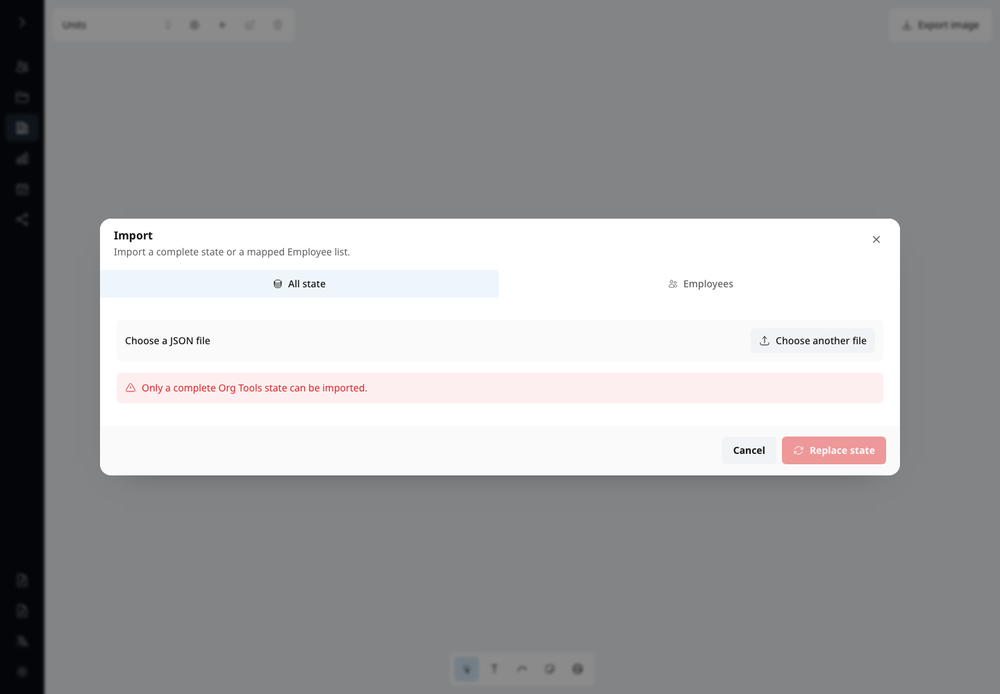](screenshots/feature-import-invalid-state.png)

Reject partial, arbitrary, or malformed JSON without changing data and offer an immediate file re-selection action.

Capabilities: Strict rejection, No mutation, Choose another file.

## Export

### Direct state Export

Download the complete current state in one click, including current in-memory changes.

Capabilities: One-click JSON, Complete state, Includes current changes.

## Theme

### Dark theme

Use the expanded sidebar theme menu to choose Light, Dark, or System appearance.

Capabilities: Dark theme, Light option, System option, Expanded sidebar.

### Light shell and expanded navigation

[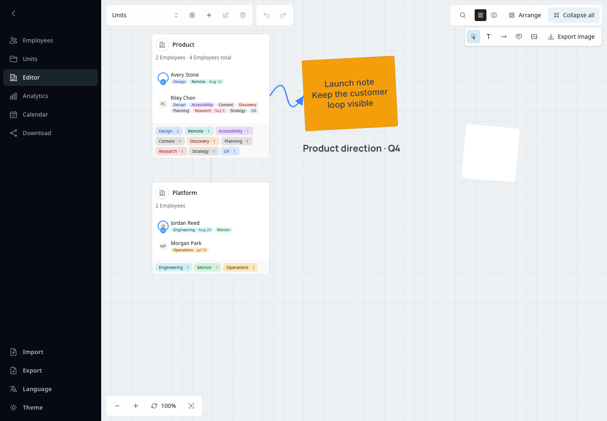](screenshots/feature-theme-light-shell.png)

Inspect the light interface with expanded module labels and locally accessible actions.

Capabilities: Light theme, Expanded sidebar, Module labels, Local actions.

## Language

### Russian interface

Switch the complete interface in place using the bundled Russian and English catalogs.

Capabilities: Russian locale, In-place switching, Localized navigation, Persistent locale.

### English language menu

[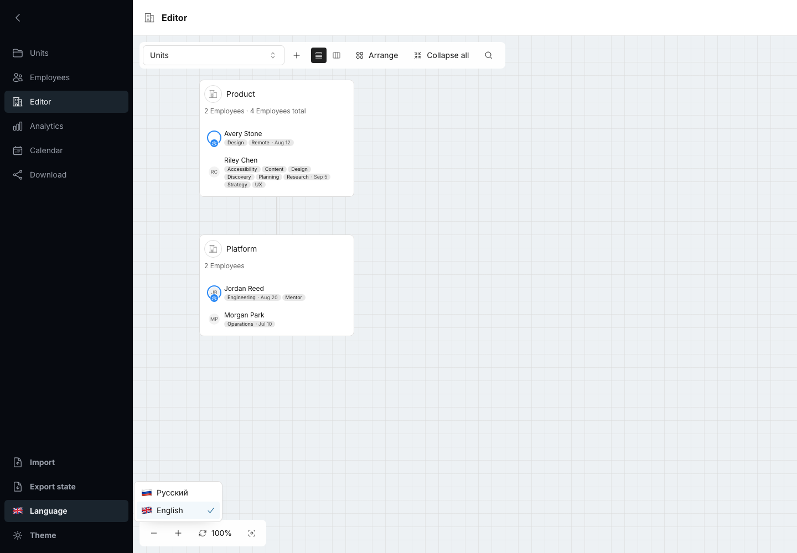](screenshots/feature-language-english-menu.png)

Open the English language selector with stable rows, flags, names, and selected state.

Capabilities: English locale, Flag selector, Selected indicator, Stable menu geometry.

## Teams

### Team hierarchy and roster

Browse the edge-aligned hierarchy, selected path, searchable roster count, and one contiguous direct
and descendant Employee roster with tags and row actions but no redundant section headings.

Capabilities: Nested Teams, Search and counts, Unified roster, Employee actions.

### Create a manual Team

[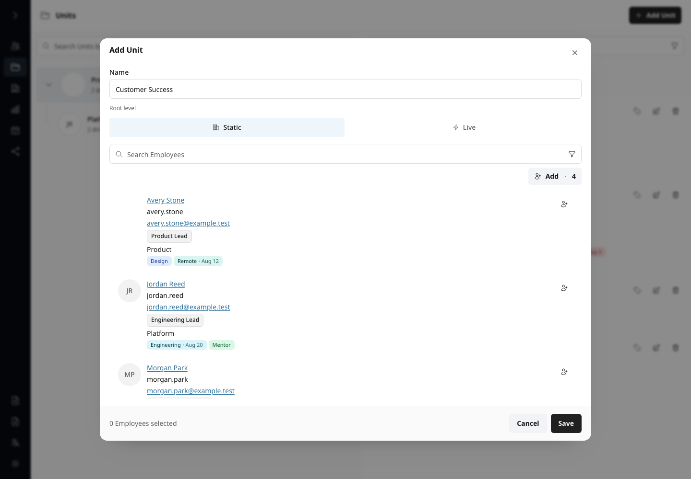](screenshots/feature-teams-create-manual.png)

Create a root Team with manual membership and configure its identity and structure.

Capabilities: Create Team, Manual membership, Root hierarchy.

### Configure a Live Team

[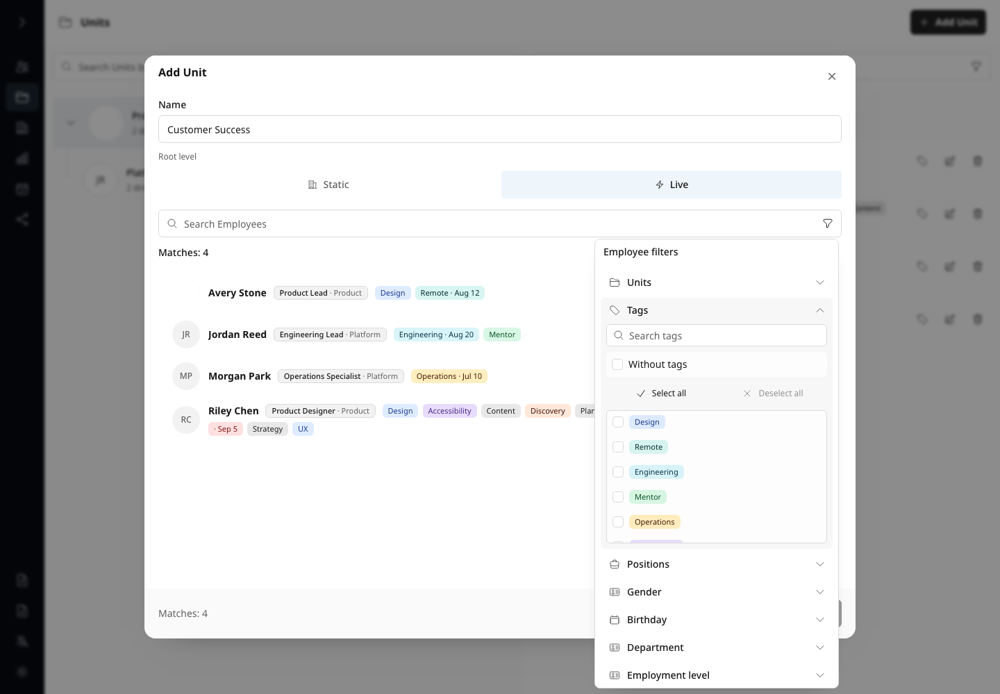](screenshots/feature-teams-create-live.png)

Build dynamic membership from Employee birthday, position, tags, and source Team rules.

Capabilities: Live membership, Birthday filters, Position filters, Tag filters, Source Teams.

### Edit Team assignments

[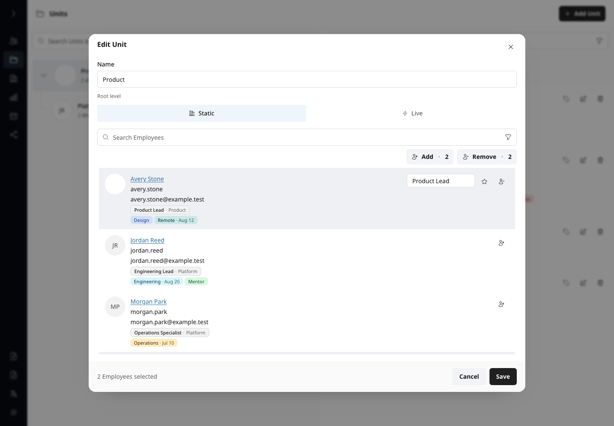](screenshots/feature-teams-edit.png)

Edit a Team, select its boss, and manage Employee positions and membership assignments.

Capabilities: Edit Team, Boss assignment, Membership, Per-Team positions.

## Employees

### Employee catalog

Search the complete Employee catalog and use tag, edit, delete, contact, and Team context actions.

Capabilities: Virtualized catalog, Search and counts, Tags, Contact links, Row actions.

### Compound Employee filters

[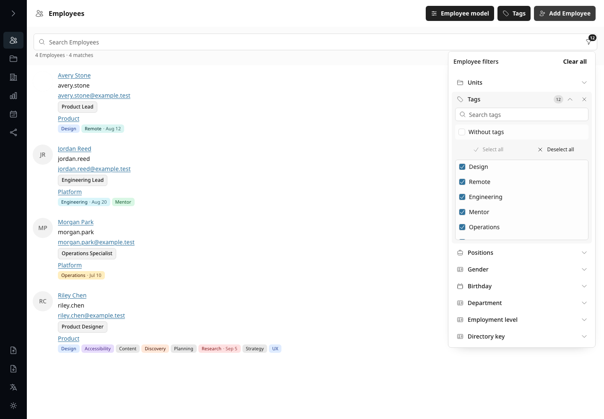](screenshots/feature-employees-filters.png)

Compose birthday, gender, position, tag, Team, and text criteria with visible match counts.

Capabilities: Birthday filter, Gender filter, Position filter, Tag filter, Team filter.

### Employee profile and assignments

[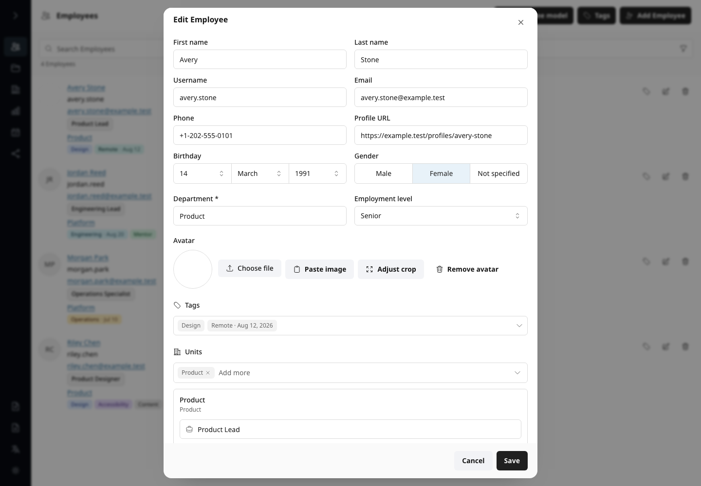](screenshots/feature-employees-form.png)

Edit identity, contact, gender, birthday, embedded avatar, tags, Team membership, boss state, and positions.

Capabilities: Identity and contact, Gender and birthday, Embedded avatar, Tags, Team assignments.

### Tag date calendar

[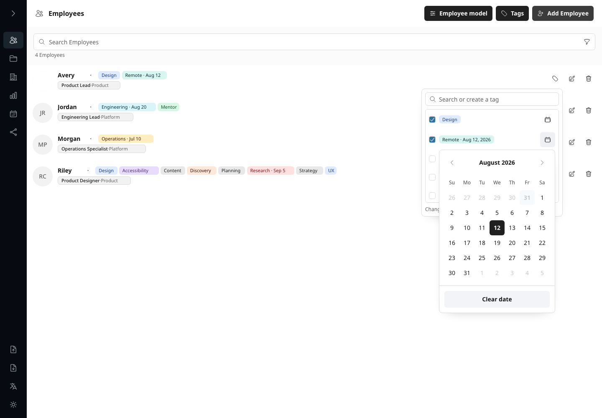](screenshots/feature-employees-tag-date.png)

Apply or clear one exact date for an Employee tag through the localized calendar popover.

Capabilities: Quick tags, Dated tags, Calendar picker, Clear date.

### Employee Team assignments

[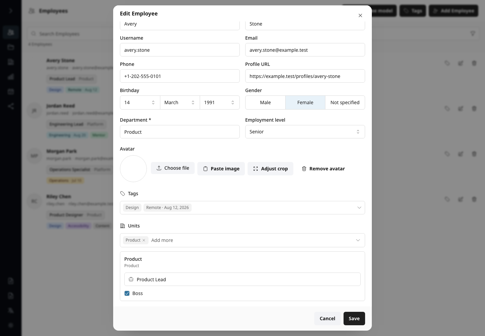](screenshots/feature-employees-form-assignments.png)

Inspect the lower Employee form with Team membership, boss state, and per-Team positions.

Capabilities: Team membership, Boss state, Per-Team positions, Multiple assignments.

### Local avatar crop

[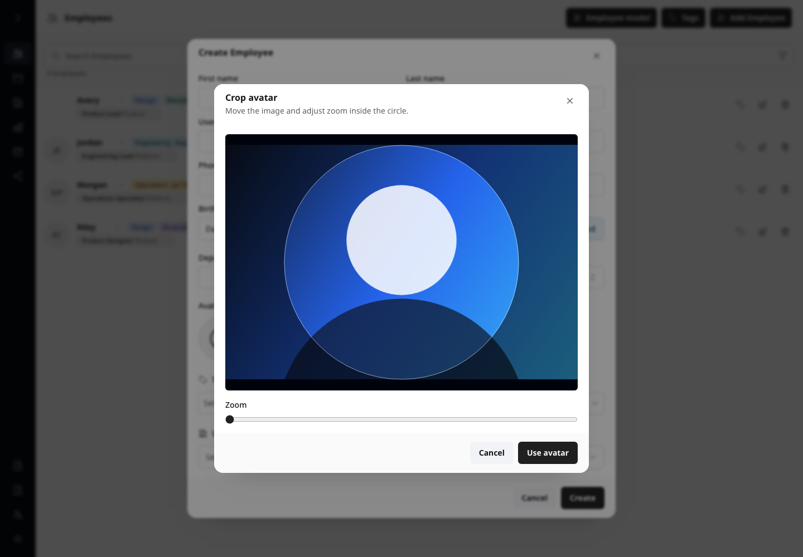](screenshots/feature-employees-avatar-crop.png)

Crop and zoom a local PNG, JPEG, WebP, or pasted image before embedding it into the organization state.

Capabilities: Local file, Clipboard image, Crop and zoom, Embedded WebP.

## Editor

### Visual organization Editor

Arrange opaque Unit cards on the adaptive snap grid with frame-bounded gestures, hierarchy lines, zoom, history, and normal-weight layout controls.

Capabilities: Canvas layout, Adaptive snap grid, Hierarchy, Zoom, Arrange and collapse.

### Custom View management

[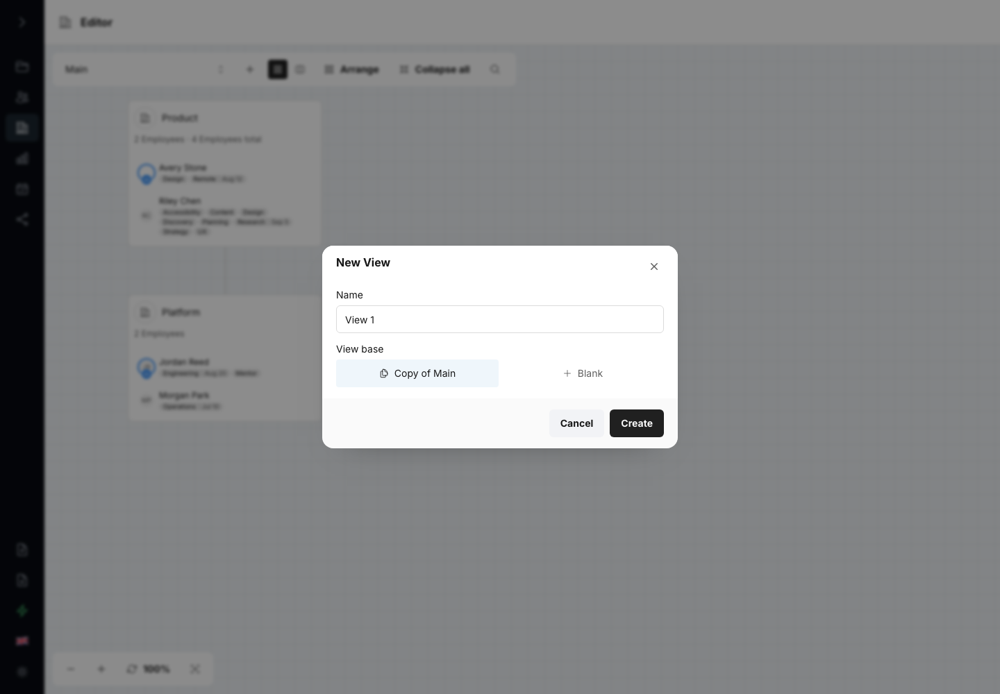](screenshots/feature-editor-views.png)

Switch Views and create an empty or Units-derived independent organization canvas.

Capabilities: Built-in Units View, Custom Views, Copy from Units, Empty View.

### Editor search

Reveal the right-growing search field, locate Units and Employees without leaving the canvas, and clear the query when Search closes.

Capabilities: Unit search, Employee search, Canvas navigation.

### Custom View selection and actions

[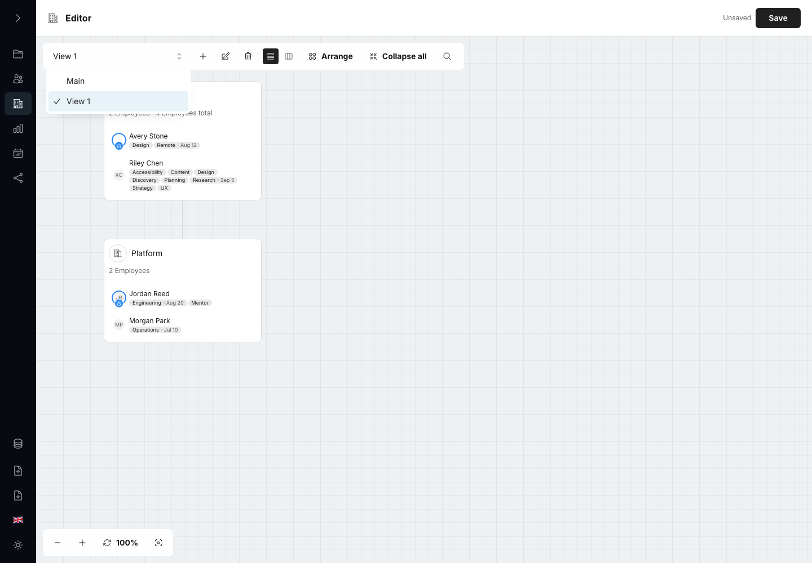](screenshots/feature-editor-view-management.png)

Switch between the built-in Units View and an empty independent custom View while retaining
accessible rename and confirmed delete actions.

Capabilities: View selection, Built-in Units View, Empty custom View, Rename, Confirmed Delete.

### Unit context commands

[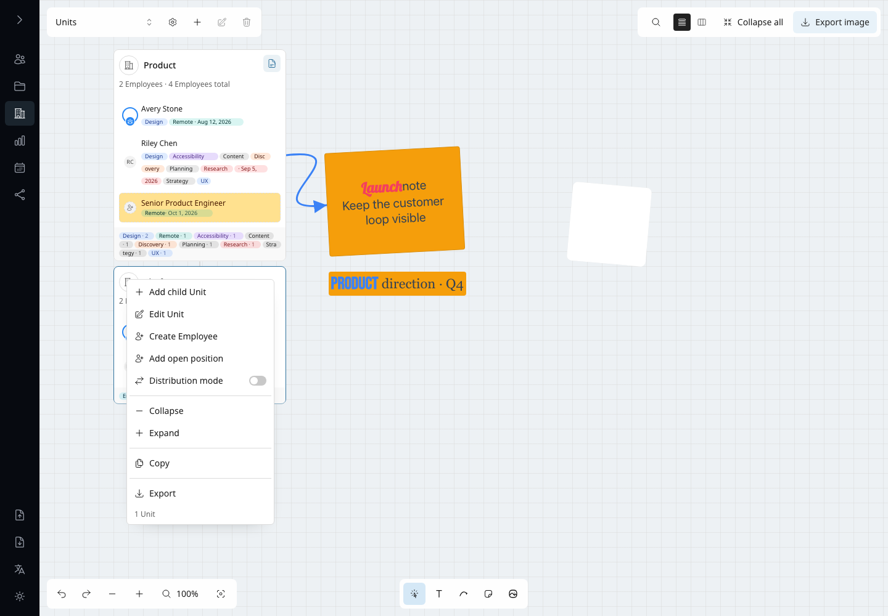](screenshots/feature-editor-unit-commands.png)

Open Unit commands for editing, adding hierarchy, collapse and expand, copy, and local export.

Capabilities: Context menu, Add child Unit, Edit, Collapse and expand, Copy, Export.

### Bulk Employee commands

[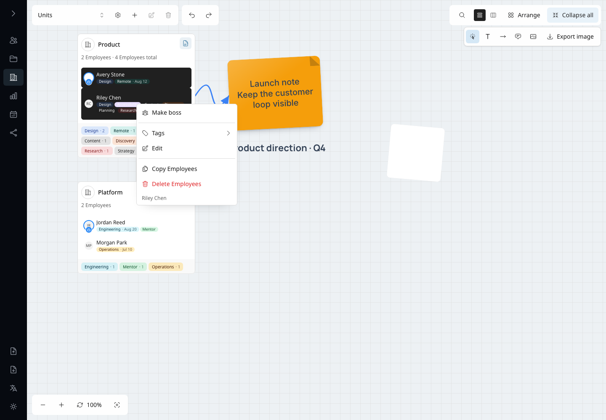](screenshots/feature-editor-bulk-employees.png)

Select multiple Employee rows and apply shared boss, tag, edit, copy, or delete actions.

Capabilities: Multi-selection, Boss assignment, Bulk tags, Edit, Copy, Delete.

### Editor image export

[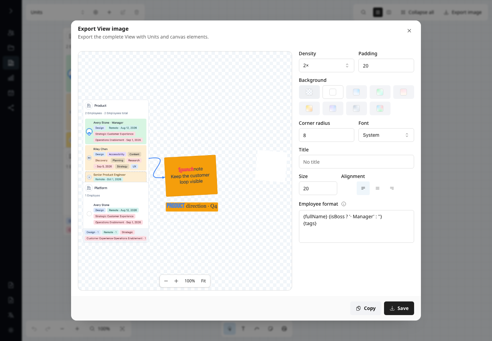](screenshots/feature-editor-image-export.png)

Preview a local PNG export and choose scope, transparent, solid, or gradient backgrounds.

Capabilities: PNG export, Scope, Live preview, Background presets.

### Editor text template export

[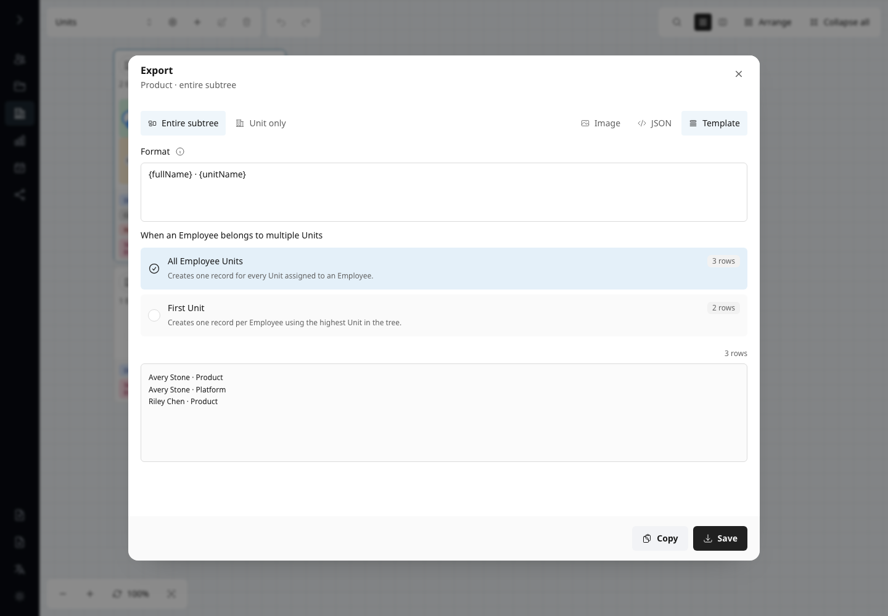](screenshots/feature-editor-template-export.png)

Build a text representation from Employee and Unit tokens with a live preview.

Capabilities: Text template, Field tokens, Scope, Live preview.

### Editor image detail settings

[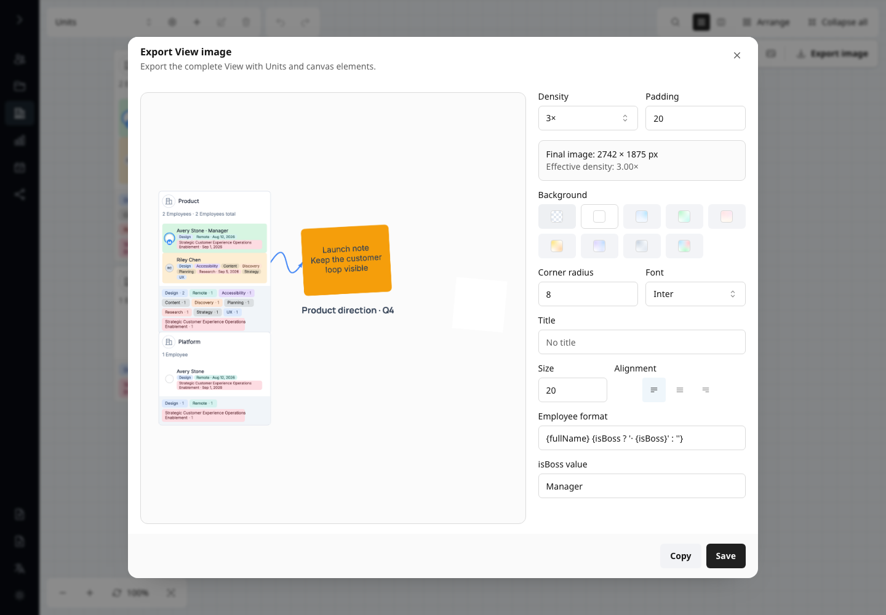](screenshots/feature-editor-image-settings.png)

Configure PNG title, font, spacing, alignment, boss label, and Employee card content below the preview.

Capabilities: Title and font, Spacing and alignment, Boss label, Employee card content.

## Analytics

### Organization Analytics

Review sortable position, birth month, birthday, first-name, last-name, and full-name distributions.

Capabilities: Six distributions, Counts, Sorting, Virtualized rows.

### Complete Analytics groups

[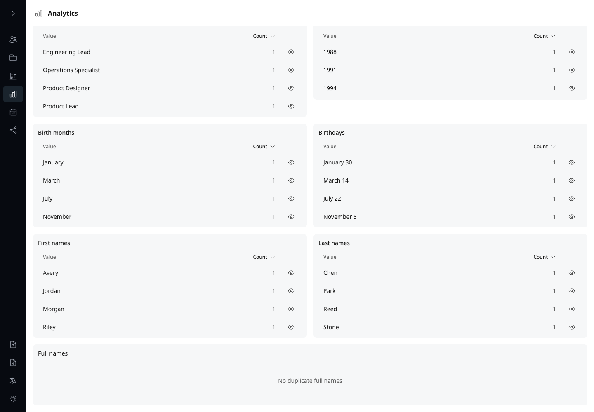](screenshots/feature-analytics-complete-groups.png)

Scroll the unified Analytics surface to inspect the remaining name distributions and bounded groups.

Capabilities: Last names, Full names, Content-sized groups, Internal scrolling.

### Analytics drill-down

[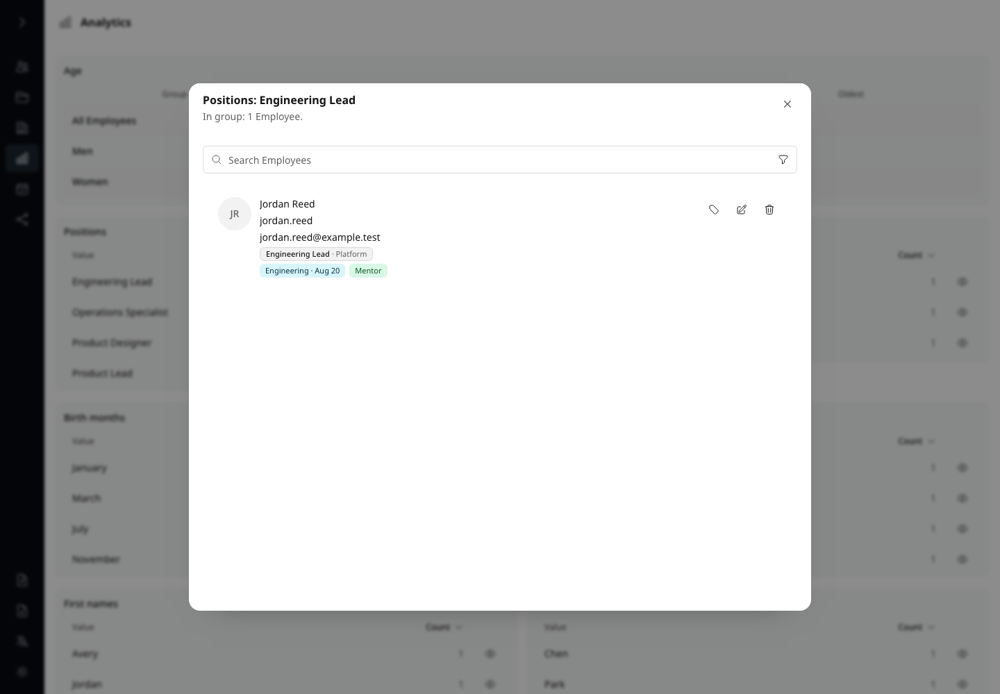](screenshots/feature-analytics-drilldown.png)

Open a distribution value to inspect matching Employee cards and their normal actions.

Capabilities: Value drill-down, Matching Employees, Employee actions.

## Calendar

### Employee Calendar

Navigate a monthly calendar with birthdays, uniformly spaced dated-tag counts, events, and a strong current-day state.

Capabilities: Monthly navigation, Birthdays, Dated tags, Today state, Tag cloud.

### Calendar day details

[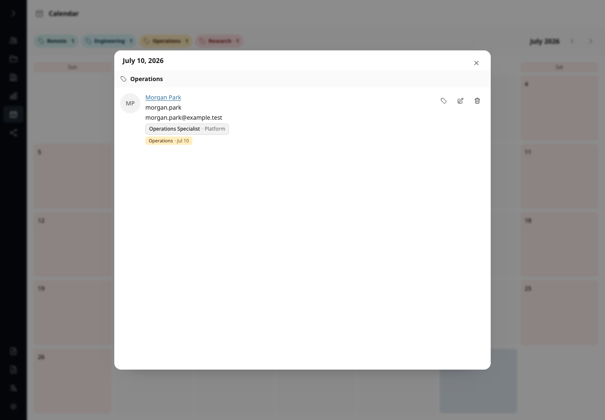](screenshots/feature-calendar-day-details.png)

Open a dated-event date to inspect complete Employee cards, every event label, and the ordinary
right-aligned actions without a redundant section heading.

Capabilities: Interactive dates, Conditional content, Dated-event cards, Tag history, Employee actions.

### Dated-tag event history

[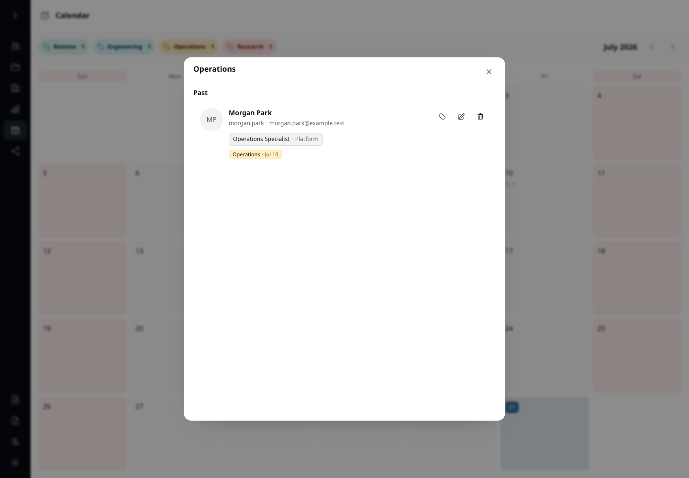](screenshots/feature-calendar-tag-events.png)

Open a tag from the bounded cloud to inspect current and future events without a redundant heading,
plus conditional past events as complete Employee cards with right-aligned actions.

Capabilities: Tag cloud, Conditional history, Complete Employee cards, Employee actions, Virtualized dialog.

## Download

### Template Data Download

Configure a separator-based template, row mode, field tokens, live preview, copy, and local download.

Capabilities: Template format, Row mode, Field tokens, Preview, Copy and download.

### Download source selection

[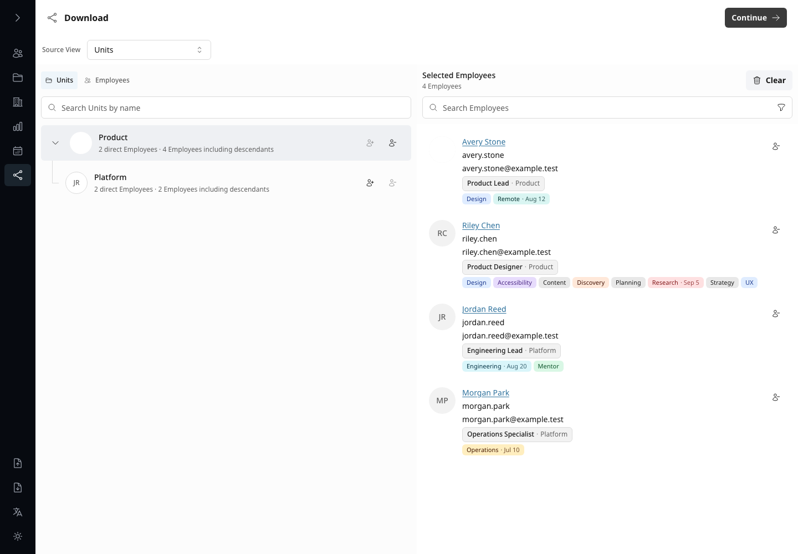](screenshots/feature-download-source-selection.png)

Select Employees from Teams or the catalog, inspect and filter the resulting set, then continue from the shared header.

Capabilities: Team sources, Employee sources, Selected set, Search and filters, Exclusions.

### CSV Download settings

[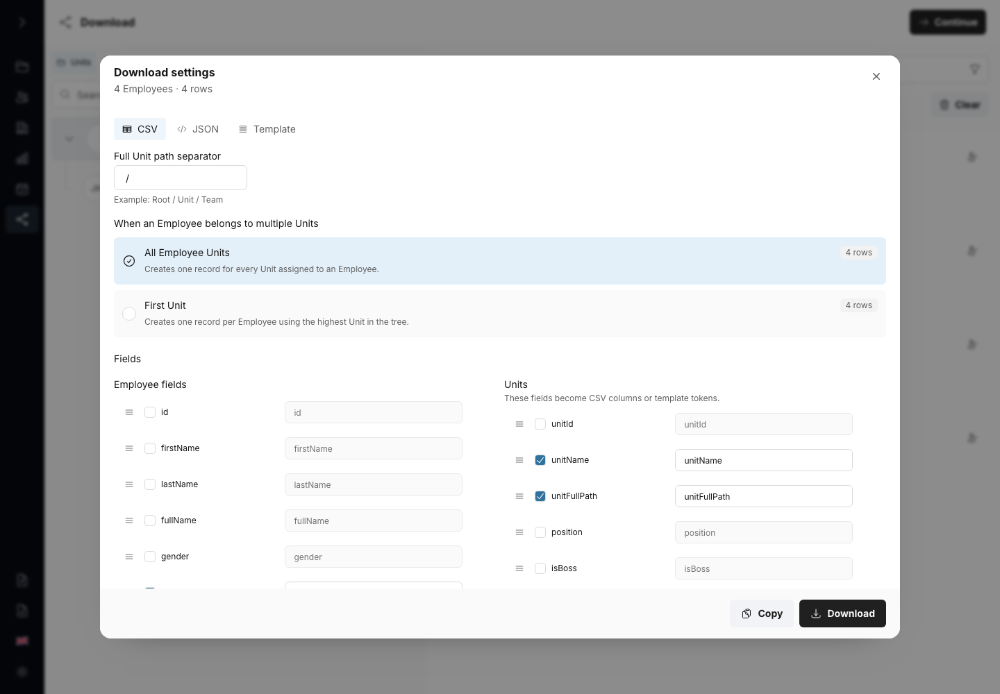](screenshots/feature-download-csv-settings.png)

Choose row behavior and reorder, select, or rename Employee and Team fields for CSV output.

Capabilities: CSV, Field selection, Rename and reorder, Row modes.

### JSON Download settings

[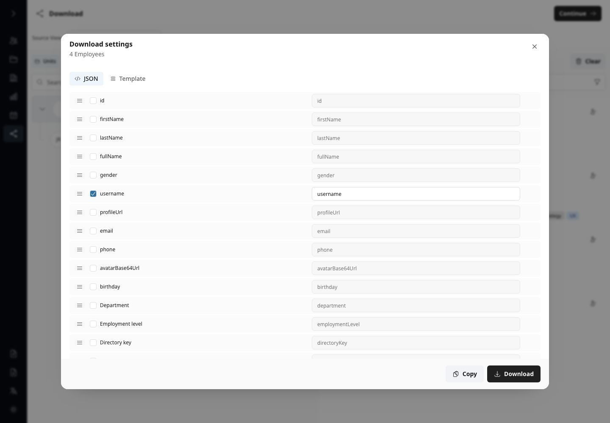](screenshots/feature-download-json-settings.png)

Choose Employee fields and configure the fields of each nested Team object for JSON output.

Capabilities: JSON, Employee fields, Nested Team fields, Field order.

### CSV Download preview

[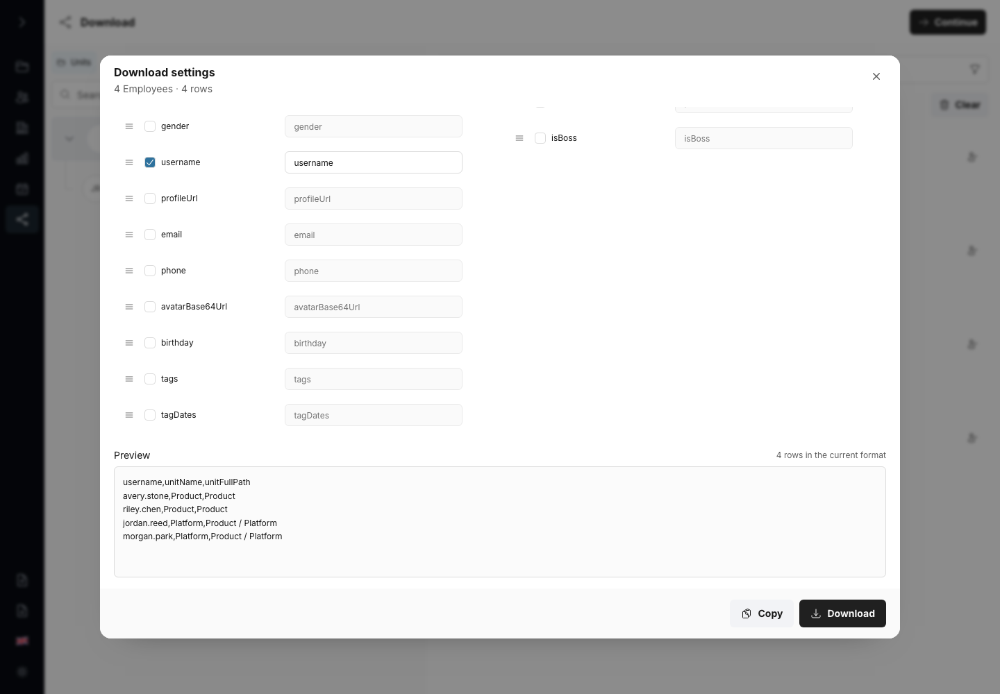](screenshots/feature-download-csv-preview.png)

Inspect the lower field list and live CSV rows before copying or downloading the local file.

Capabilities: Remaining fields, Live CSV rows, Copy, Local download.

### JSON Download preview

[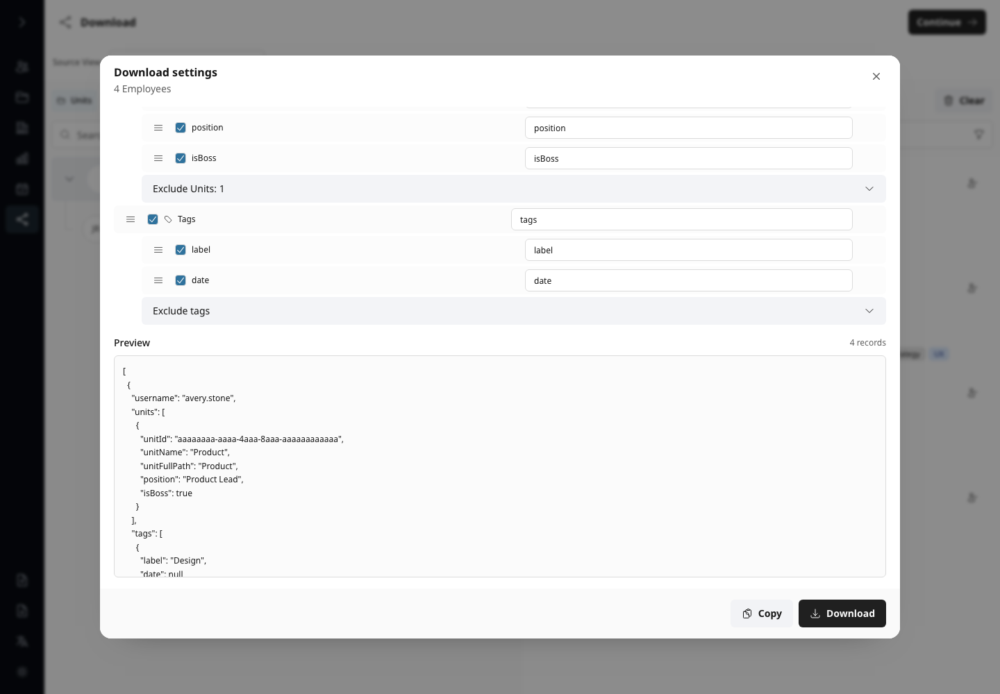](screenshots/feature-download-json-preview.png)

Inspect the lower field list and formatted JSON structure before copying or downloading the local file.

Capabilities: Remaining fields, Formatted JSON, Copy, Local download.

## MCP

These server-only supporting frames are absent from the browser-only Pages runtime.

### MCP access consent

[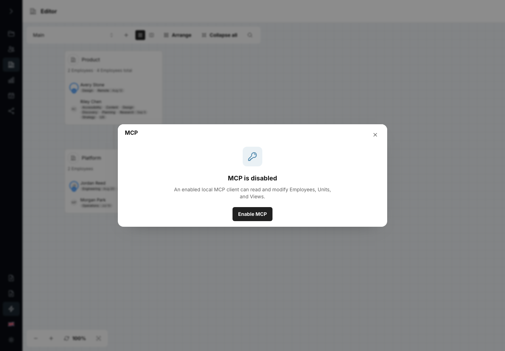](screenshots/feature-mcp-disabled-consent.png)

Review the local full-access boundary and the icon-bearing Enable action before enabling MCP.

Capabilities: Disabled by default, Explicit consent, Full access.

### MCP credentials

[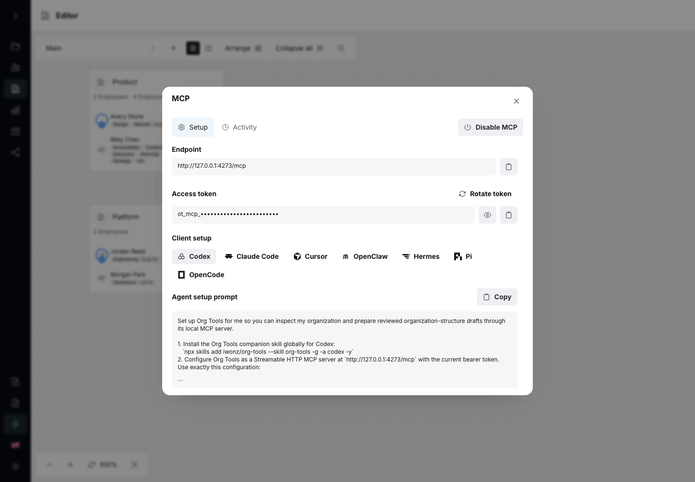](screenshots/feature-mcp-enabled-credentials.png)

Use the icon-bearing Setup and Activity controls, loopback endpoint, masked token controls, and
green enabled sidebar signal.

Capabilities: Loopback endpoint, Masked token, Enabled signal, Rotation.

### MCP client setup

[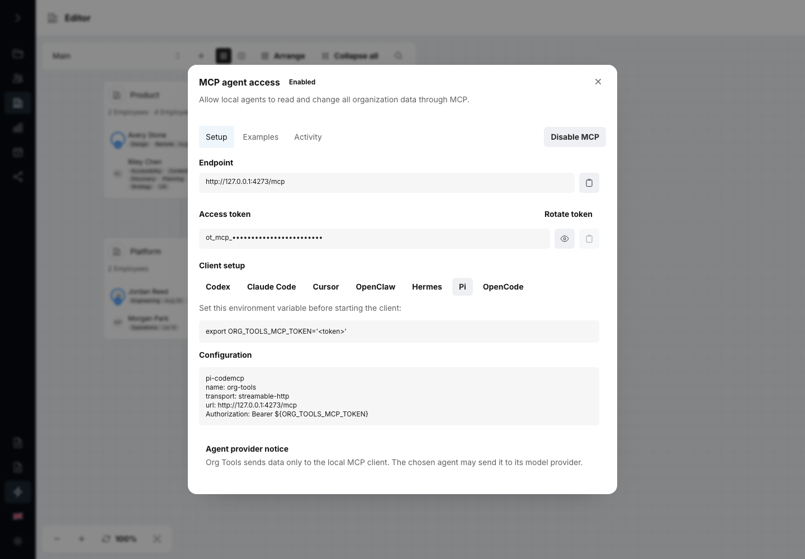](screenshots/feature-mcp-client-setup.png)

Copy one agent setup prompt containing the selected skill install, current token, exact client
configuration, reload step, and read-only verification.

Capabilities: Installable skill, Codex, Claude Code, Cursor, OpenClaw, Hermes, Pi, OpenCode.

### Applied MCP activity

[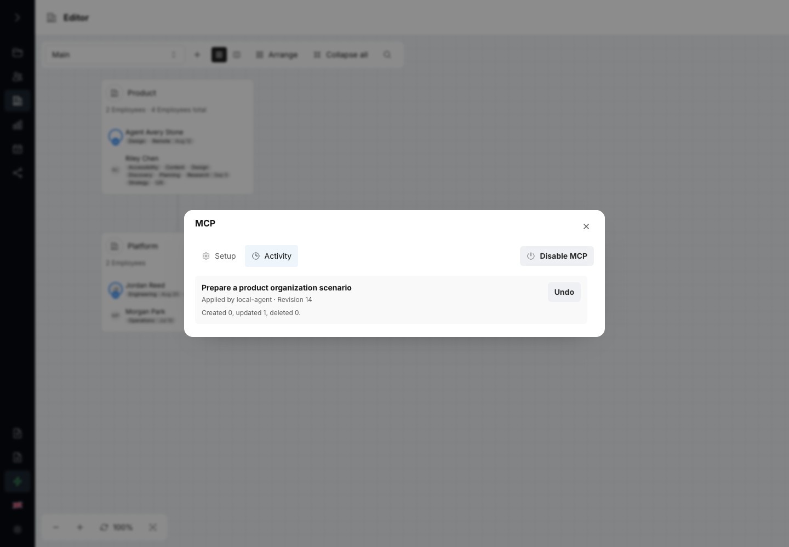](screenshots/feature-mcp-applied-activity.png)

Inspect the server-authored summary, actor, reason, revision, and selective Undo action.

Capabilities: Activity journal, Exact summary, Revision, Undo.

### Selective Undo conflict

[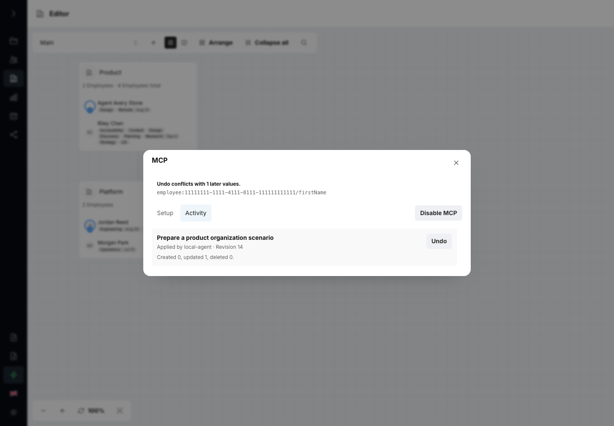](screenshots/feature-mcp-selective-undo-conflict.png)

Block Undo when a later edit changed the same value and identify the exact overlap.

Capabilities: Safe Undo, Overlap blocking, Conflict details, No silent loss.

## Review checklist

- Confirm Import and direct state Export are clear and contain no project, file, Save, or autosave controls.
- Review light and dark themes, English and Russian menus, compact and expanded sidebar geometry, and every product module.
- Confirm startup uses one centered icon-only loader with no visible technical status copy.
- Confirm dialogs, popovers, filters, error states, Editor exports, Analytics drill-down, Calendar events, and Download previews are fully visible.
- Confirm thematic icons precede text in buttons and tabs while disclosure, sorting, removal,
  status, and count affordances retain their semantic trailing positions.
- Confirm Units has no empty hierarchy header, its path/search aligns to roster avatars, direct and
  descendant Employees form one contiguous list, and its count sits below search without roster-section headings.
- Confirm Calendar day details omit the Dated tags heading, group same-day labels by Employee, and
  expose complete Employee cards with Tag, Edit, and Delete actions.
- Confirm Calendar tag history omits the Current and upcoming heading and exposes complete Employee
  cards while retaining the conditional Past section.
- Confirm an unselected Editor Unit keeps its resting background and opacity during passive hover in
  both themes.
- Confirm the Editor labels its canonical View with the localized Units term, never exposes Rename
  or Delete for it, and keeps both actions available for an empty custom View.
- Confirm MCP frames contain only the synthetic token; the enabled icon is green; Setup, Activity,
  Enable, Disable, and token rotation use leading icons; all seven Client setup choices have their
  own leading bundled icon; and setup shows the installable-skill prompt rather than a standalone
  configuration block.
- Confirm every Pages frame and sidebar state contains no MCP action, dialog, endpoint request, or server-only marker.
- Require a clean browser diagnostic report for every server and Pages scenario; investigate new warnings instead of broadening an allowlist.
- Reject real data, local filesystem paths, browser notifications, external images, nondeterministic timestamps, clipping, or unintended overlays.
- Regenerate immediately; all 43 PNGs must retain identical hashes. Material differences require review and a deliberate update.
