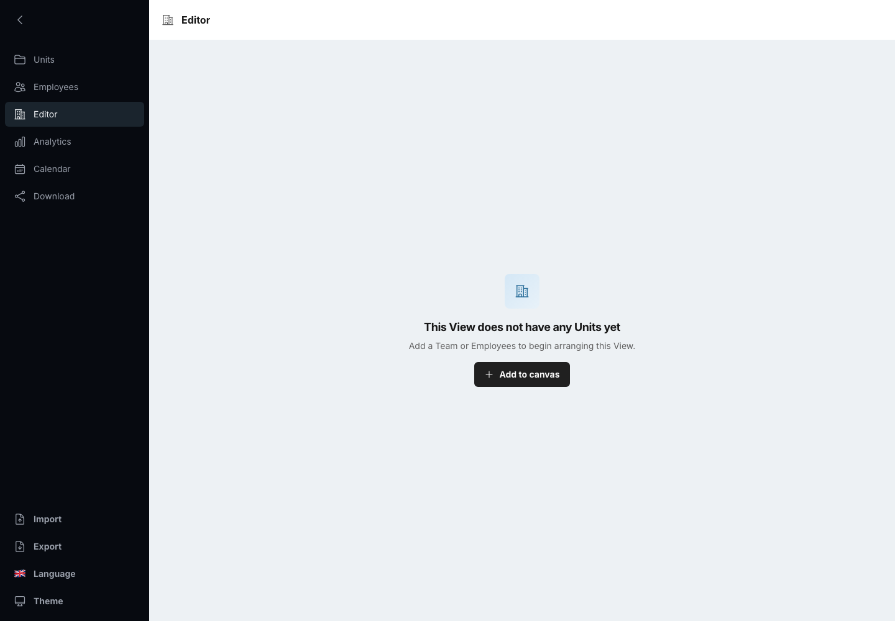
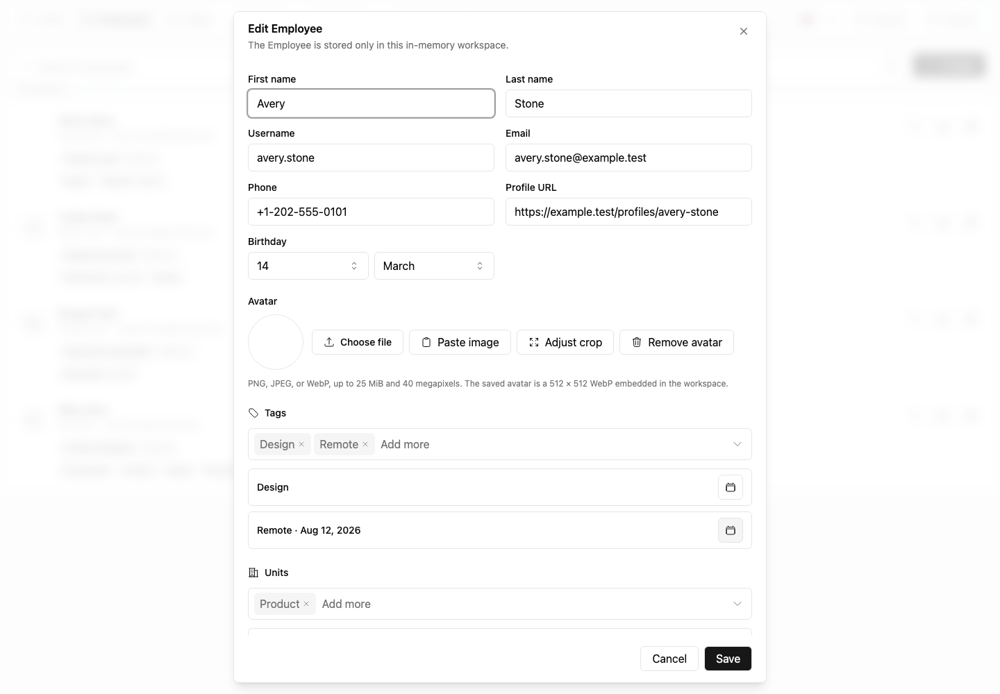
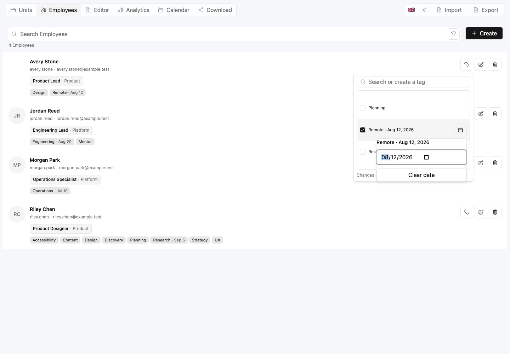
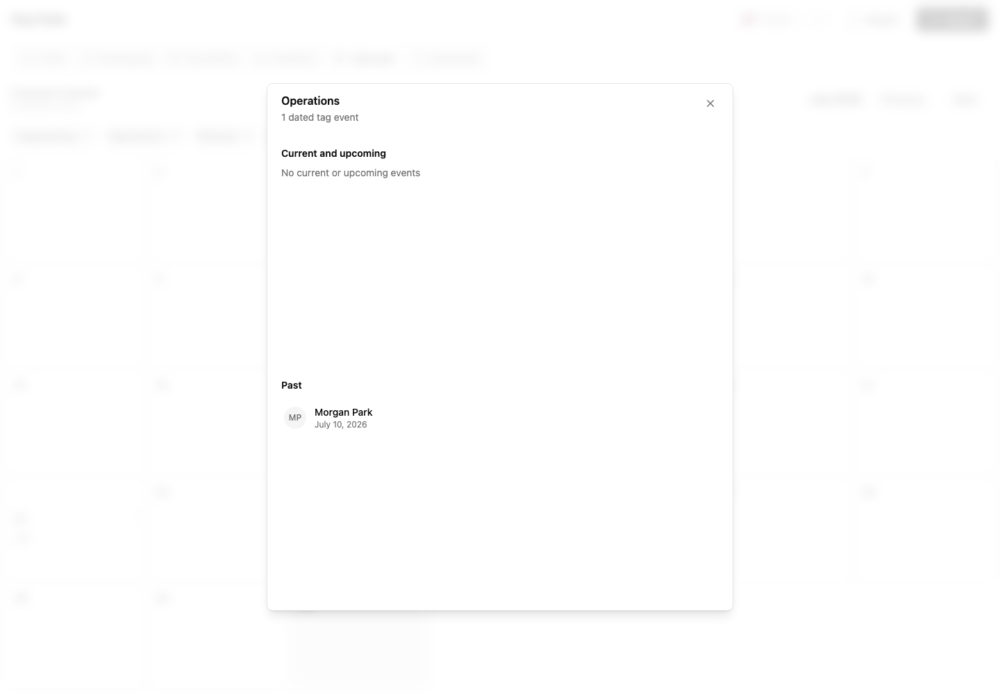
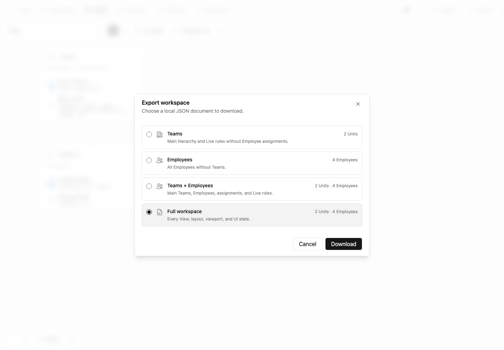
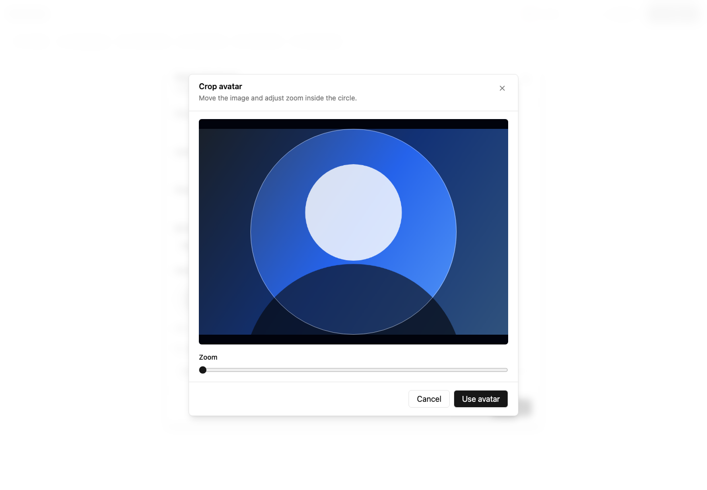
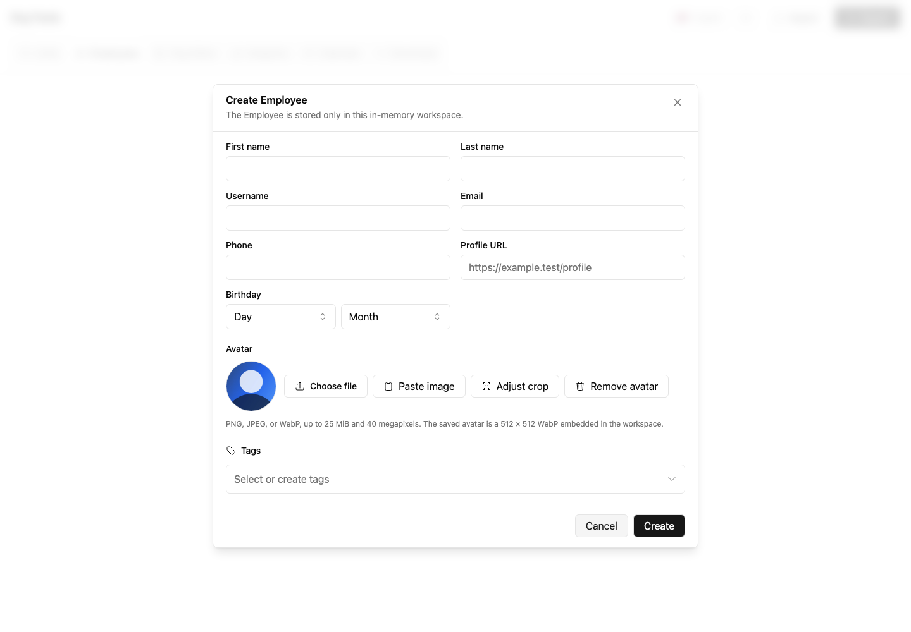
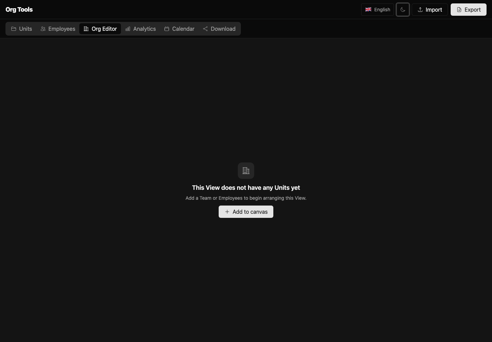
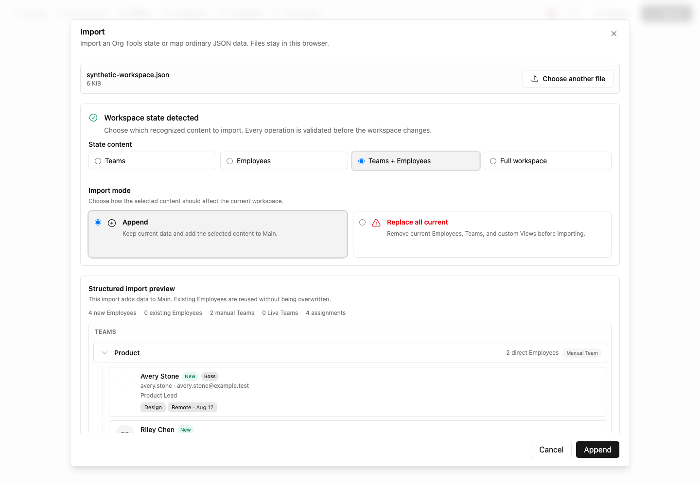

# Screenshots

The gallery is generated by Playwright against the static production build. Tests use Chromium, a
1440 by 1000 viewport, UTC, the `en-US` locale, light mode, reduced motion, loaded local fonts, and
disabled animations. The helper also sets `org-tools-locale=en` before navigation so browser or
machine preferences cannot change gallery copy.

## Gallery

### Empty Editor



### Synthetic organization canvas


### Synthetic Employees catalog


### Synthetic Download surface


### Synthetic analytics


### Synthetic Employee Calendar


### Employee dated tags



### Dated tag quick editor



### Dated tag events



### Workspace Export formats



### Employee avatar crop



### Employee avatar form



### Dark shell and unified header



### Employee import mapping


### Scoped state import choices and preview



The Calendar fixture includes exact dated-tag events and its compact cloud. Scoped state operation
cards, nested Team and Employee previews, generic mapping, the unified header, and localized empty
states are also covered by browser assertions. Every gallery capture uses the deterministic English
locale; targeted Russian desktop checks verify wider labels.
Populated captures intentionally omit a replacement-import filename banner. The Employees capture
shows one containing layout around search, its total catalog count, actions, and contiguous rows.
The gallery verifies one uninterrupted theme-aware background across the header, top-level
containers, and transparent populated workflow islands; consistent segmented tab switchers; one
contiguous global-action island; compact split panes without vertical rules; the Org Editor top-left
and bottom-left action islands; right-revealing Editor search; quiet borderless Analytics groups with
12 px gaps; and preserved owned surfaces for controls, Employee and Team cards, selection cards,
calendars, hierarchy guides, focus, and destructive states.

## Regenerate

Install the matching browser once, then generate the build and PNGs:

```sh
pnpm --filter @org-tools/screenshots exec playwright install chromium
pnpm screenshots:generate
```

Inspect every changed PNG. Do not accept a screenshot that contains real organization data, a local
filesystem path, a browser notification, a nondeterministic timestamp, or an external image.

`pnpm test:browser` runs the non-visual smoke scenarios against the same production server. The
smoke suite verifies blank startup, the wordmark-free unified header, its continuous light and dark
shell background, distinct bounded surfaces, the contiguous keyboard-accessible product-tab island,
consistent nested switchers, the contiguous global-action island, the flag-only locale trigger,
responsive transfer actions at 390, 1024, and 1280 px,
absence of locale-provider console errors, the simplified empty states, all
four scoped workspace Export downloads, state projection append/replace, local avatar workflows,
hidden tag date popovers, the 1280 by 720 Calendar layout, generic JSON mapping, rejection of malformed
claimed states, wrapped Org Editor and PNG tags, and same-origin-only requests.
It also verifies silent replacement completion, localized Employee total and match counts, reactive
count changes, borderless normal and destructive dialog chrome, a contained 390 px Import layout,
contiguous Employee rows, shell-continuous populated workflow layouts, absent source-pane rules,
compact Teams and Analytics spacing, left-aligned grouped Editor controls, preserved meaningful
outlines, and Analytics backgrounds, dynamic height, row cap, sorting, drill-down, and border
behavior.
