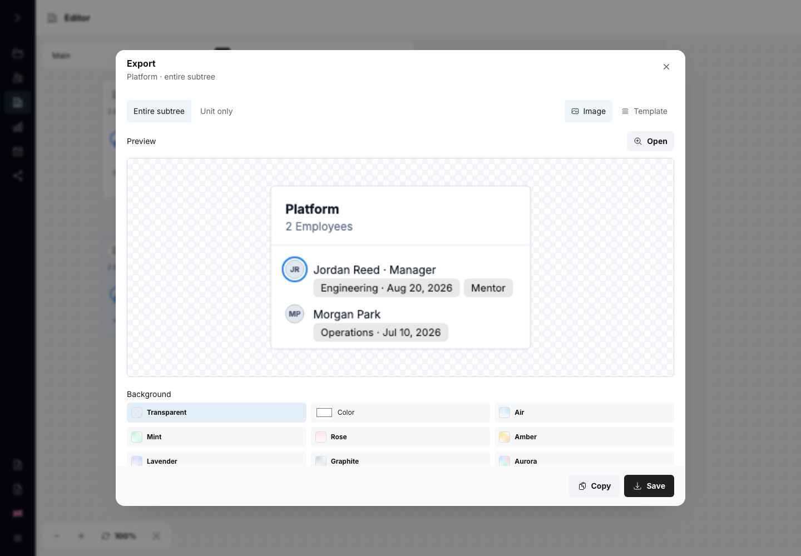

# Screenshots

The gallery is generated by Playwright against the static production build. Tests use Chromium, a
1440 by 1000 viewport, UTC, the `en-US` locale, light mode, reduced motion, loaded local fonts, and
disabled animations. The helper also sets `org-tools-locale=en` before navigation so browser or
machine preferences cannot change gallery copy.

## Gallery

### Empty Editor


### Synthetic organization canvas


### Org Editor image export



### Synthetic Employees catalog


### Synthetic Download surface


### Synthetic analytics


### Synthetic Employee Calendar


### Employee dated tags


### Dated tag quick editor


The quick editor uses the same localized UI-kit calendar in every Employee workflow and keeps date
clearing separate from day selection without repeating the tag label.

### Dated tag events


### Workspace Export formats


### Employee avatar crop


### Employee avatar form


### Dark shell and expanded sidebar


### Employee import mapping


### Scoped state import choices and preview


The Calendar fixture includes exact dated-tag events and its compact cloud. Scoped state operation
cards, nested Team and Employee previews, generic mapping, the collapsible sidebar, and localized empty
states are also covered by browser assertions. Every gallery capture uses the deterministic English
locale; targeted Russian desktop checks verify wider labels and the bare numeric Calendar year.
Populated captures intentionally omit a replacement-import filename banner. The Employees capture
shows search, its total catalog count, actions, and contiguous rows directly on the root surface.
Successful workspace and Download-tab saves also remain visually silent; browser tests assert the
downloaded files while copy confirmation and errors retain their interface feedback.
The gallery verifies full-bleed light and dark workflows without decorative outer frames or empty
perimeter gutters; a dark expanded sidebar with tonal active navigation; one Inter UI typeface;
restrained steel-blue signal details with nearly neutral blue-gray interaction surfaces;
compact tonal split panes without vertical rules; pointer states without decorative borders,
outlines, inset hairlines, or added hover elevation; no decorative brand glyph; centered compact
sidebar icons that keep their horizontal coordinate through a continuous right-edge transition; no
visible Org Tools title; a collapse control with the same 48 by 40 px compact footprint, 14 px
horizontal padding, icon size, and fixed icon axis as compact navigation items in both sidebar modes;
geometry-stable pressed states; no decorative shadow on ordinary controls, cards,
shell chrome, or Editor toolbars; restrained separation depth only on true overlays;
stable theme and language menu rows; surfaced
Org Editor top-left and bottom-left toolbar groups over a neutral canvas and adaptive snap grid;
card-consistent neutral tags in local image export; right-revealing Editor search; borderless tonal
Analytics groups with one uniform inner tone and compact gaps; borderless tonal Calendar cells with
fixed date-number geometry and a stronger today state; compact tag rows; Employee gender fields and
filters; Calendar Employee actions; and preserved semantic boundaries for fields, data previews,
hierarchy guides, Editor nodes, focus, drag targets, and destructive states.

## Regenerate

Install the matching browser once, then generate the build and PNGs:

```sh
pnpm --filter @org-tools/screenshots exec playwright install chromium
pnpm screenshots:generate
```

Inspect every changed PNG. Do not accept a screenshot that contains real organization data, a local
filesystem path, a browser notification, a nondeterministic timestamp, or an external image.

`pnpm test:browser` runs the non-visual smoke scenarios against the same production server. The
smoke suite verifies blank startup, the expanded and compact sidebar, the context-only header,
full-bleed light and dark workflows, keyboard-accessible tonal product destinations, consistent
nested tabs, uniform computed UI typography, borderless pointer interaction, reduced-motion
behavior, evenly centered compact icons, the stable collapse control, sidebar-owned locale and
theme controls without highlighted-row geometry shifts, localized compact tooltips, and responsive shell
containment at 390, 1024, and 1280 px. It samples the desktop collapse transition to verify a
monotonic right edge, fixed navigation and collapse-icon coordinates, and clipped label opacity. It
also verifies stable pointer-down geometry, the ordinary-control shadow budget, the absence of
locale-provider console errors, the simplified empty states, all
four scoped workspace Export downloads, state projection append/replace, local avatar workflows,
UI-kit tag date popovers, the 1280 by 720 Calendar layout, generic JSON mapping, rejection of malformed
claimed states, wrapped Org Editor and PNG tags, and same-origin-only requests.
It also verifies silent replacement completion, localized Employee total and match counts, reactive
count changes, overlay-separated normal and destructive dialog chrome, a contained 390 px Import
layout, contiguous Employee rows, full-bleed populated workflows, tonal source panes without rules,
aligned top boundaries without per-tab outer margins, compact Teams and Analytics spacing,
left-aligned Editor controls, the distinct neutral canvas, preserved meaningful outlines, and
adaptive grid interval, snapped coordinate operations, and Analytics uniform grouping, dynamic
height, row cap, sorting, and drill-down behavior.
Focused assertions also cover opaque Editor command hover, exact-value gender filtering and form
round trips, 44 px quick-tag rows, the localized non-native tag calendar and clear action, uniformly
actionable Calendar dates, locale-clean month titles, and live Calendar day updates after Employee
edit or deletion.
